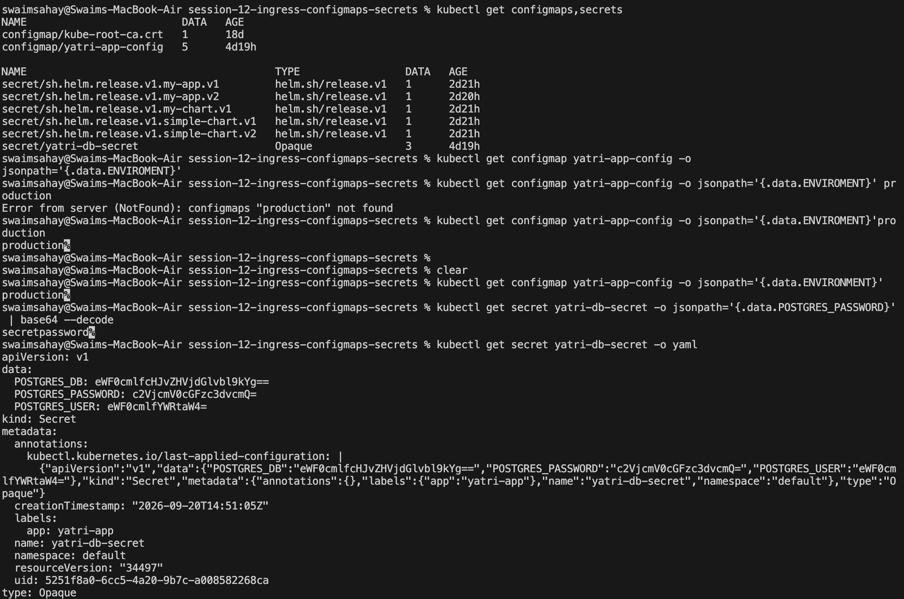
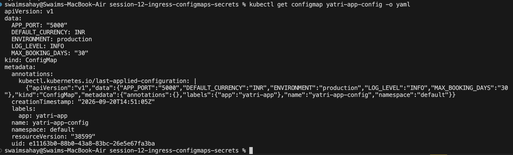

# Kubernetes Ingress Assignment

## 1. Difference between Ingress and Ingress Controller

- **Ingress**: A Kubernetes API object that defines the rules for routing external HTTP and HTTPS traffic to internal cluster services. It acts strictly as a configuration file or blueprint.
- **Ingress Controller**: The actual software application (such as NGINX, HAProxy, or Traefik) running inside the cluster that reads the Ingress rules and executes the traffic routing. Without an Ingress Controller, the Ingress resource does nothing.

## 2. Difference between Path-based and Host-based Routing

- **Host-based Routing**: Directs incoming traffic to different services based on the domain name (hostname) requested in the HTTP header.
  - *Example*: Traffic to `api.example.com` routes to Service A, while traffic to `shop.example.com` routes to Service B.
- **Path-based Routing**: Directs incoming traffic to different services based on the specific URL path structure under a single domain.
  - *Example*: Traffic to `example.com/api` routes to Service A, while traffic to `example.com/shop` routes to Service B.

## 3. In Class Commands

### ConfigMaps and Secrets

