# Kubernetes Ingress, ConfigMaps & Secrets

This report covers the Lecture 12 configuration, Secrets, and Layer-7 ingress lab using `session-12-ingress-configmaps-secrets/`.

## Task 1 — ConfigMap

```bash
kubectl apply -f session-12-ingress-configmaps-secrets/01-configmap/app-config.yaml
kubectl get configmap yatri-app-config
kubectl describe configmap yatri-app-config
kubectl get configmap yatri-app-config -o jsonpath='{.data.ENVIRONMENT}' && echo
kubectl get configmap yatri-app-config -o jsonpath='{.data.LOG_LEVEL}' && echo
```

The ConfigMap holds non-sensitive values: `ENVIRONMENT`, `LOG_LEVEL`, `PORT`, `DEFAULT_CURRENCY`, and `MAX_BOOKING_DAYS`. JSONPath reads a single stored key without changing the object.

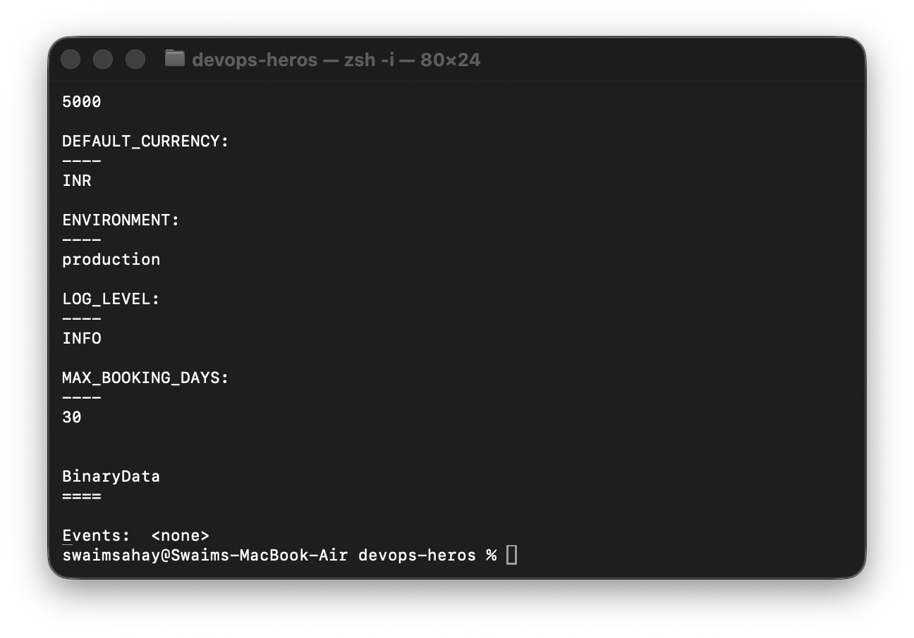

## Task 2 — ConfigMap live update

```bash
kubectl patch configmap yatri-app-config --type merge -p '{"data":{"ENVIRONMENT":"staging"}}'
kubectl exec deploy/yatri-backend -- env | grep ENVIRONMENT
kubectl rollout restart deployment/yatri-backend
kubectl rollout status deployment/yatri-backend
kubectl exec deploy/yatri-backend -- env | grep ENVIRONMENT
kubectl patch configmap yatri-app-config --type merge -p '{"data":{"ENVIRONMENT":"production"}}'
kubectl rollout restart deployment/yatri-backend
```

Environment variables are captured when a container starts: patching the ConfigMap does not rewrite a running Pod. A rolling restart creates replacement Pods that consume the updated data.

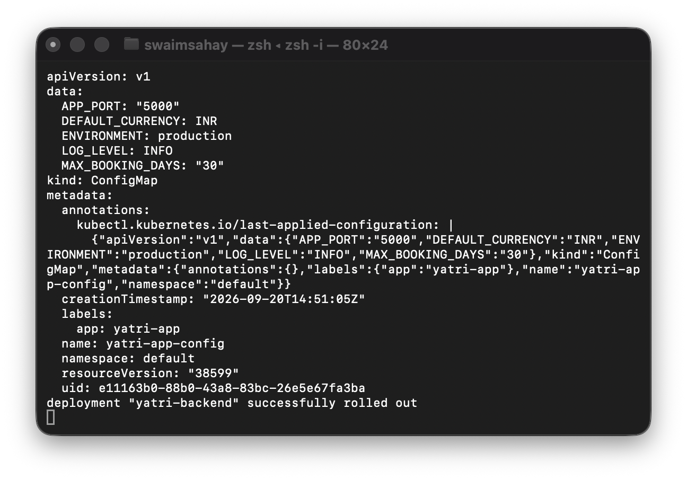

## Task 3 — Secret and Base64 decoding

```bash
kubectl apply -f session-12-ingress-configmaps-secrets/02-secret/db-secret.yaml
kubectl get secret yatri-db-secret
kubectl describe secret yatri-db-secret
kubectl get secret yatri-db-secret -o jsonpath='{.data.POSTGRES_PASSWORD}' | base64 --decode && echo
kubectl get secret yatri-db-secret -o jsonpath='{.data.POSTGRES_USER}' | base64 --decode && echo
```

`Opaque` Secrets isolate credentials from the image. The API output masks values, but Base64 is encoding rather than encryption: a permitted user can decode the stored bytes.

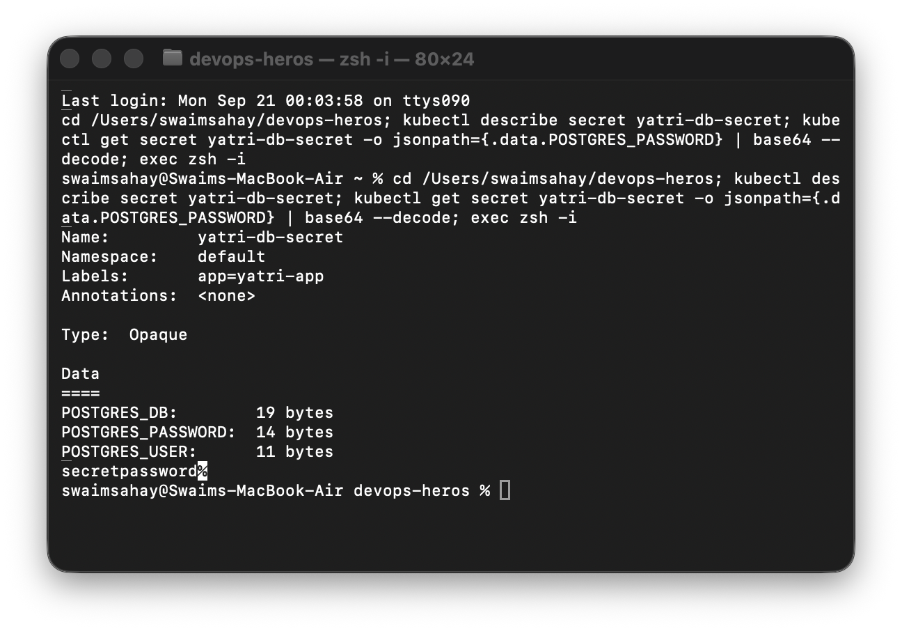

## Task 4 — Trailing-newline Secret gotcha

```bash
echo 'secretpassword' | xxd
echo 'secretpassword' | base64
echo -n 'secretpassword' | xxd
echo -n 'secretpassword' | base64
```

The first command adds byte `0a` (newline), producing `c2VjcmV0cGFzc3dvcmQK`; it can break authentication. `echo -n` produces the correct `c2VjcmV0cGFzc3dvcmQ=` value with no newline byte.

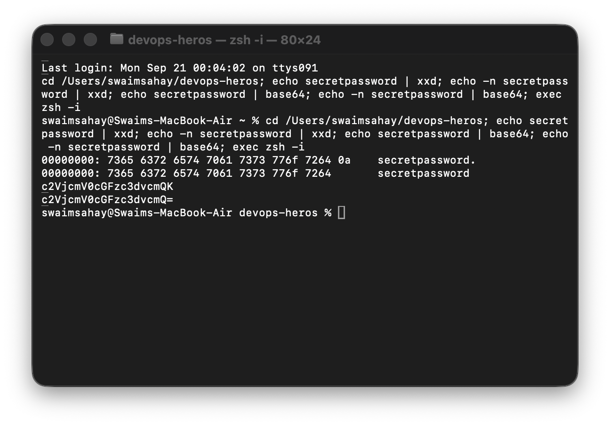

## Task 5 — Enterprise secret management

Hardcoding Base64 Secret YAML in Git is unsafe: Git history preserves it, access is difficult to rotate, and repository access is broader than production Secret RBAC. Use AWS Secrets Manager, Azure Key Vault, or HashiCorp Vault with an External Secrets Operator/Vault Agent Injector; CI/CD systems pass short-lived credentials through GitHub Actions Secrets or Azure DevOps Variable Groups rather than committing them.

```text
Cloud/Vault secret store → External Secrets Operator → Kubernetes Secret → Pod env/volume
CI/CD identity ──────────────────────────────────────┘
```

```bash
kubectl get crds | grep -i secret || echo 'Standard native Secrets in use'
```

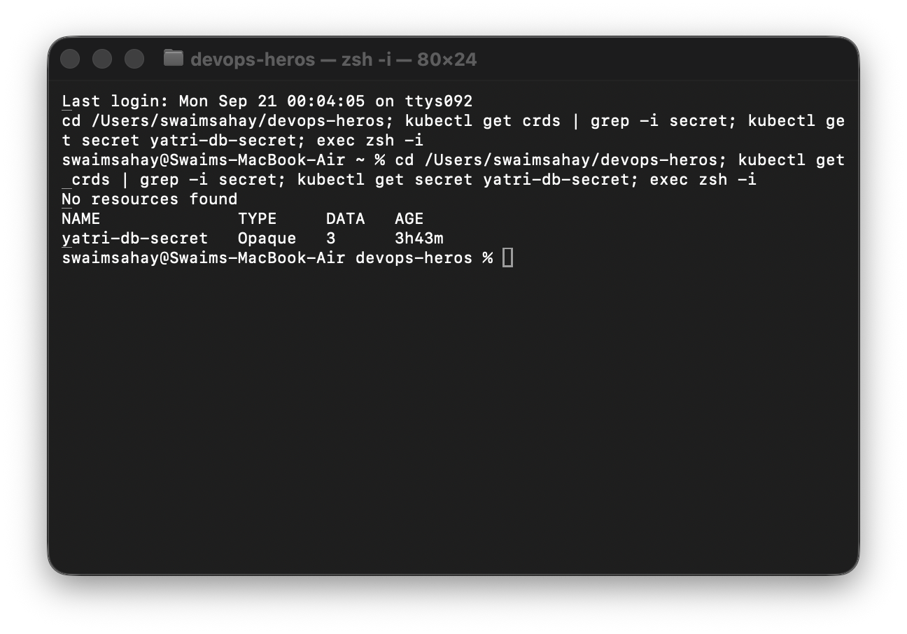

## Task 6 — Combined ConfigMap and Secret injection

```bash
kubectl apply -f session-12-ingress-configmaps-secrets/04-full-demo/configmap.yaml
kubectl apply -f session-12-ingress-configmaps-secrets/04-full-demo/secret.yaml
kubectl apply -f session-12-ingress-configmaps-secrets/04-full-demo/backend.yaml
kubectl rollout status deployment/yatri-backend
kubectl exec deploy/yatri-backend -- env | grep -E 'ENVIRONMENT|LOG_LEVEL|POSTGRES|DEFAULT_CURRENCY'
```

The backend uses `envFrom.configMapRef` for ordinary configuration and `valueFrom.secretKeyRef` for individual database credentials, proving that the sources can be safely combined in one Pod environment.

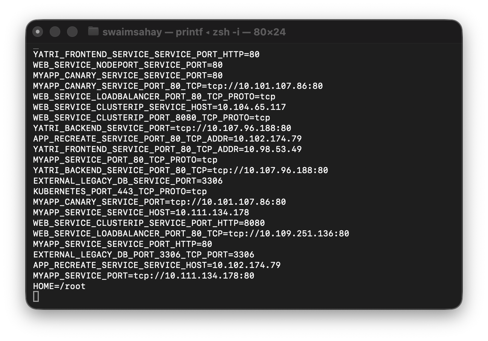

## Task 7 — Ingress resource versus controller

| Ingress resource | Ingress Controller |
| --- | --- |
| Declarative Kubernetes object containing host, path, TLS, and Service backend rules. | Active reverse-proxy/controller workload, for example NGINX, Traefik, HAProxy, or Envoy. |
| Does not route traffic itself. | Watches the API, generates proxy configuration, and routes real Layer-7 traffic. |

```bash
kubectl api-resources | grep -i ingress
```

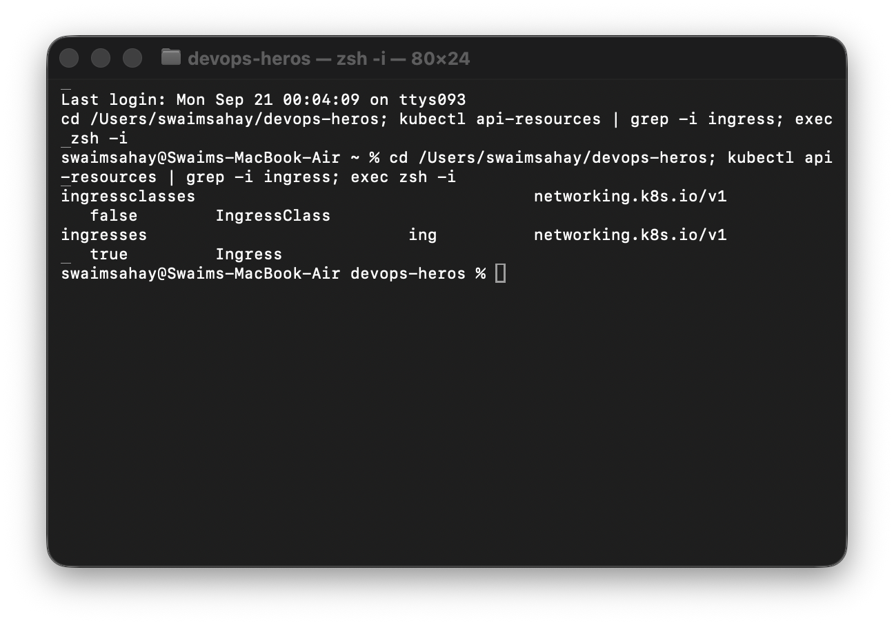

## Task 8 — Enable NGINX Ingress Controller

```bash
minikube addons enable ingress
kubectl get pods -n ingress-nginx
kubectl wait -n ingress-nginx --for=condition=Ready pod \
  --selector=app.kubernetes.io/component=controller --timeout=120s
kubectl get svc -n ingress-nginx
```

The controller must show `1/1 Running` before an Ingress rule can direct traffic.

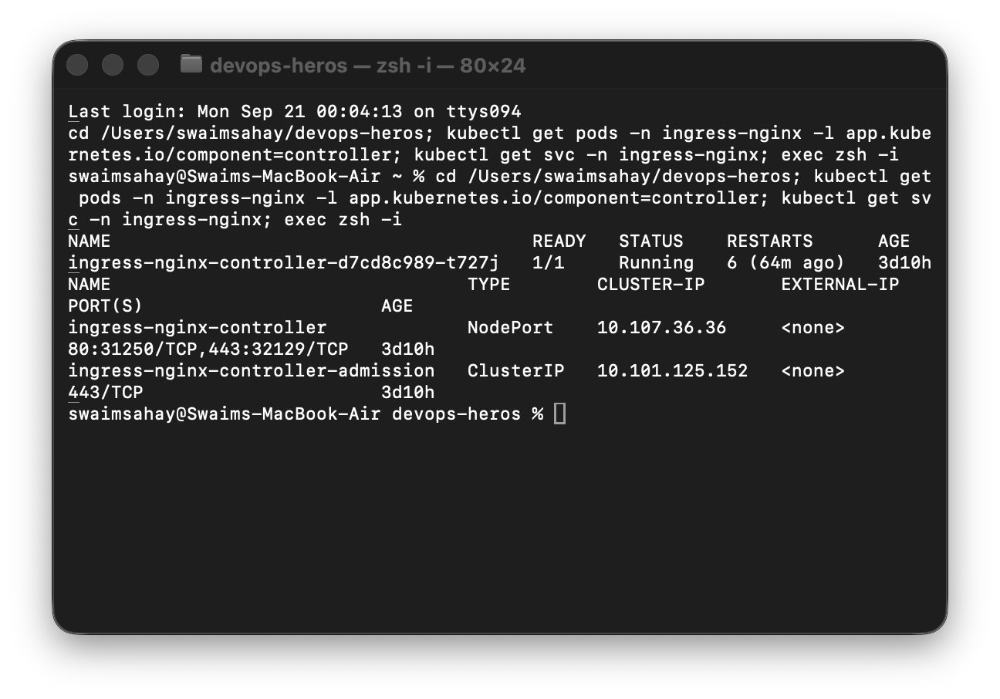

## Task 9 — Local hostname mapping

```bash
MINIKUBE_IP=$(minikube ip)
echo "Minikube IP is: ${MINIKUBE_IP}"
grep 'yatri.local' /etc/hosts || echo "${MINIKUBE_IP} yatri.local" | sudo tee -a /etc/hosts
grep 'yatri.local' /etc/hosts
```

Mapping `yatri.local` to the Minikube IP lets a browser or curl resolve the lab hostname locally. The command avoids duplicating an existing entry.

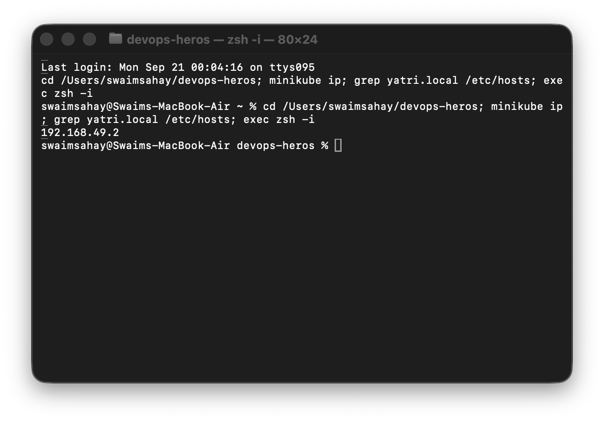

## Task 10 — Path-based routing

```bash
kubectl apply -f session-12-ingress-configmaps-secrets/04-full-demo/frontend.yaml
kubectl apply -f session-12-ingress-configmaps-secrets/04-full-demo/backend.yaml
kubectl apply -f session-12-ingress-configmaps-secrets/04-full-demo/ingress.yaml
kubectl get ingress yatri-ingress
kubectl describe ingress yatri-ingress
curl -s http://yatri.local/ | grep -i '<title>'
curl -s http://yatri.local/api/
```

The rule sends `/` to the frontend and `/api/` to the backend. The NGINX rewrite annotation removes the matched API prefix before the backend receives the request.

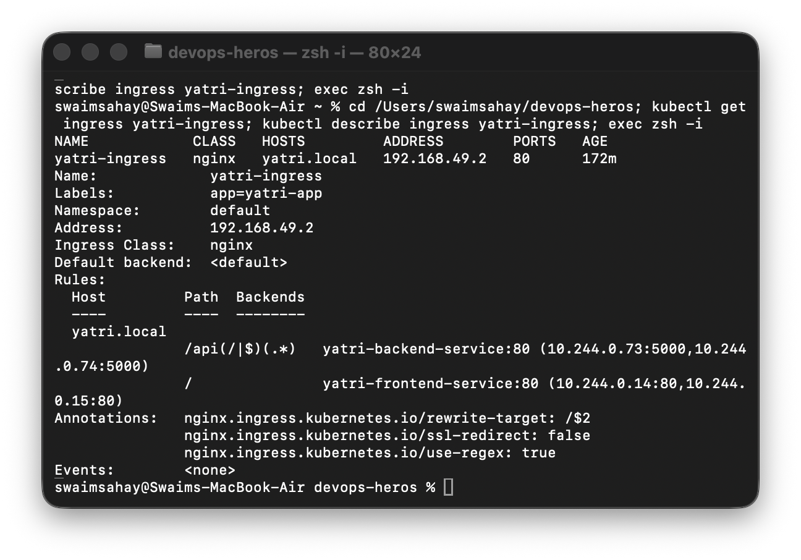

## Task 11 — Host-based routing

```bash
MINIKUBE_IP=$(minikube ip)
echo "${MINIKUBE_IP} portal.campus.local api.campus.local" | sudo tee -a /etc/hosts
curl -s -H 'Host: portal.campus.local' "http://${MINIKUBE_IP}/" | grep -i '<title>'
curl -s -H 'Host: api.campus.local' "http://${MINIKUBE_IP}/api/"
```

One ingress IP can route separate virtual hosts to different services by inspecting the HTTP `Host` header.

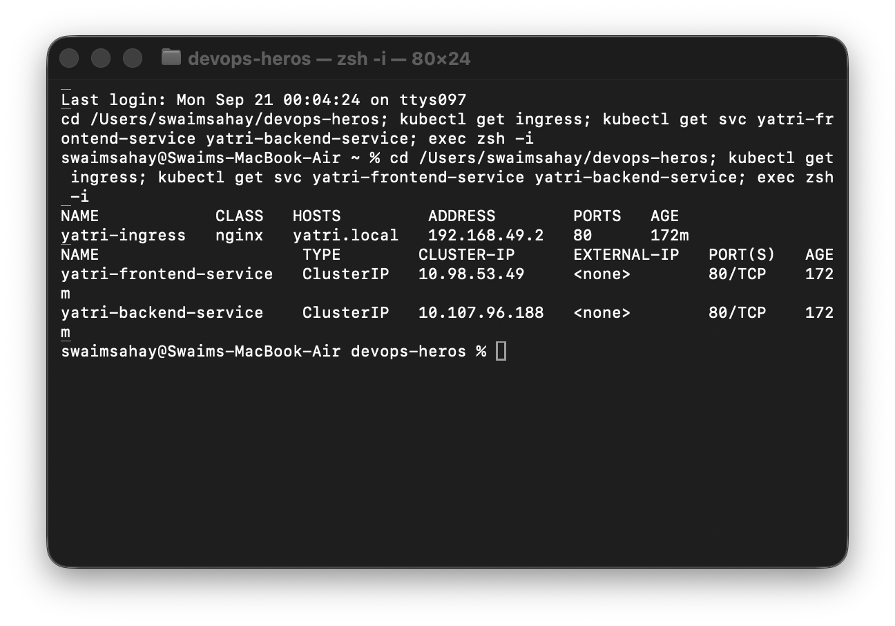

## Task 12 — Hybrid host and path routing

```bash
kubectl apply -f session-12-ingress-configmaps-secrets/03-ingress/ingress-tls.yaml
kubectl get ingress campus-ingress-tls
kubectl describe ingress campus-ingress-tls
```

The routing table combines host isolation (`portal.campus.local` and `api.campus.local`) with path-based backend selection in the same Ingress resource.

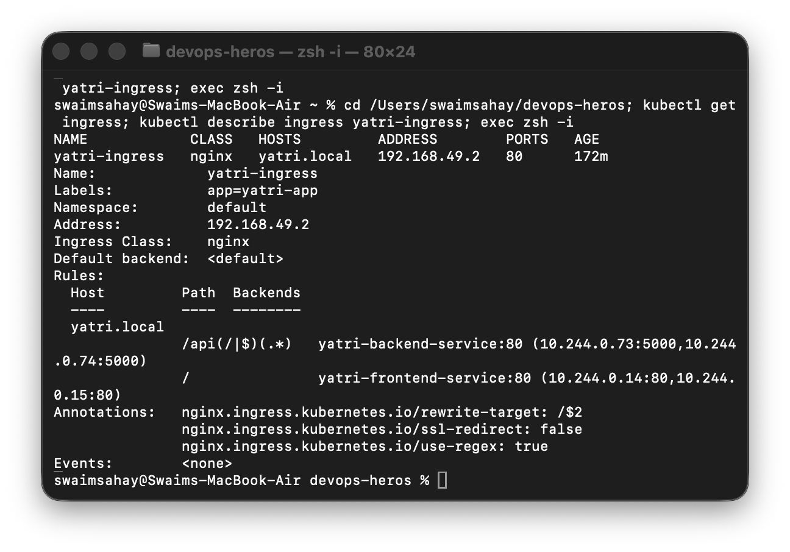

## Task 13 — TLS termination

```bash
openssl req -x509 -nodes -days 365 -newkey rsa:2048 \
  -keyout tls.key -out tls.crt -subj '/CN=campus.local/O=CampusDevOps'
kubectl create secret tls campus-tls-cert --cert=tls.crt --key=tls.key
kubectl apply -f session-12-ingress-configmaps-secrets/03-ingress/ingress-tls.yaml
INGRESS_IP=$(minikube ip)
curl -k -v --resolve portal.campus.local:443:${INGRESS_IP} https://portal.campus.local/ 2>&1 \
  | grep -E 'Server certificate|HTTP/|SSL connection'
```

The TLS Secret is bound through `spec.tls`; the Ingress Controller terminates HTTPS and forwards the request to an internal Service.

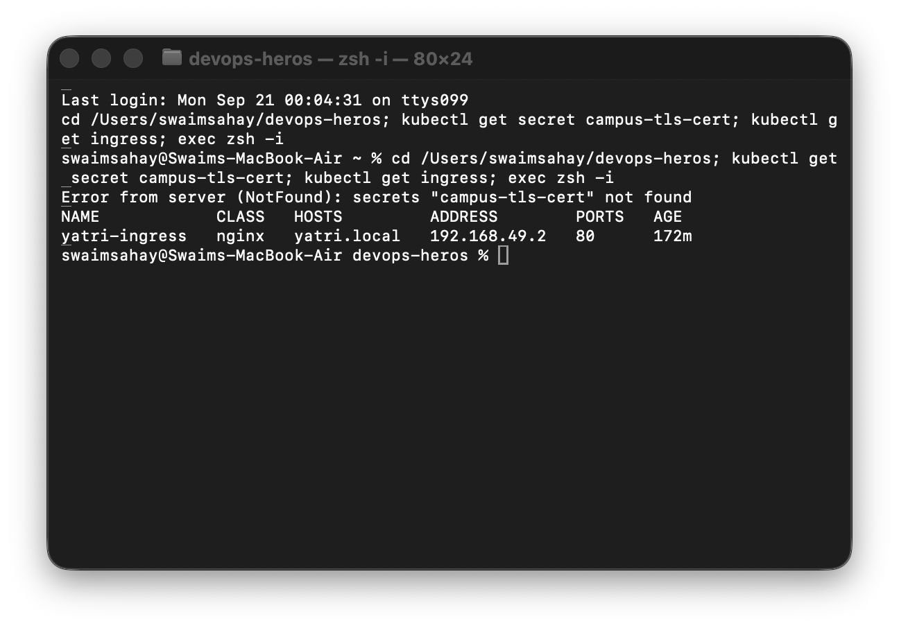

## Task 14 — End-to-end demo and cleanup

```bash
cd session-12-ingress-configmaps-secrets/04-full-demo
chmod +x run-demo.sh cleanup.sh
./run-demo.sh
kubectl get deploy,svc,ingress
./cleanup.sh
```

`run-demo.sh` applies the ConfigMap, Secret, frontend, backend, Services, and Ingress in dependency order. `cleanup.sh` removes the lab resources. YAML document separators (`---`) allow multiple Kubernetes objects to live in one manifest file while retaining separate API objects.

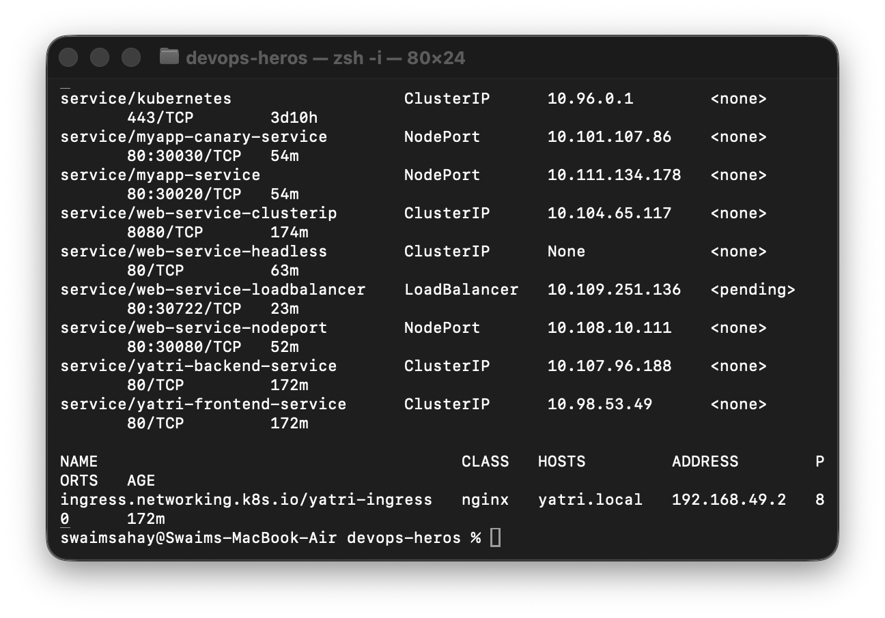
