# Kubernetes Networking & Services

This report covers Lecture 11. Commands use the supplied `session-11-kubernetes-services/` manifests.

## Task 1 — Four-port routing model

```text
Client → nodePort:30080 → Service port:8080 → targetPort:80 → containerPort:80
```

| Field | Scope and purpose |
| --- | --- |
| `containerPort` | Port on the application process inside the container; declared in the Pod specification. |
| `targetPort` | Port on selected backend Pods to which a Service forwards traffic. |
| `port` | Port exposed by the Service virtual IP (ClusterIP). |
| `nodePort` | External high port, normally `30000–32767`, opened on every node by a NodePort Service. |

```bash
kubectl explain pod.spec.containers.ports.containerPort
kubectl explain service.spec.ports
```

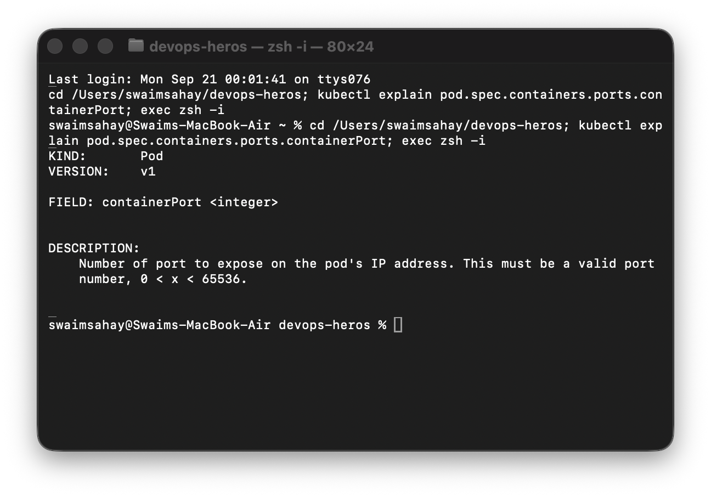

## Task 2 — ClusterIP and internal DNS

```bash
kubectl apply -f session-11-kubernetes-services/01-clusterip/app-deployment.yaml
kubectl apply -f session-11-kubernetes-services/01-clusterip/service.yaml
kubectl apply -f session-11-kubernetes-services/01-clusterip/client-pod.yaml
kubectl wait --for=condition=Ready pod/curl-client --timeout=90s
kubectl get pods -l app=web-clusterip -o wide
kubectl get svc,endpoints web-service-clusterip
kubectl exec curl-client -- curl -s http://web-service-clusterip:8080 | grep -i '<title>'
kubectl exec curl-client -- curl -s http://web-service-clusterip.default.svc.cluster.local:8080 | grep -i '<title>'
```

The three ready backend Pods are attached as Service endpoints. Both the short DNS name and FQDN return the Nginx welcome page from inside the cluster.

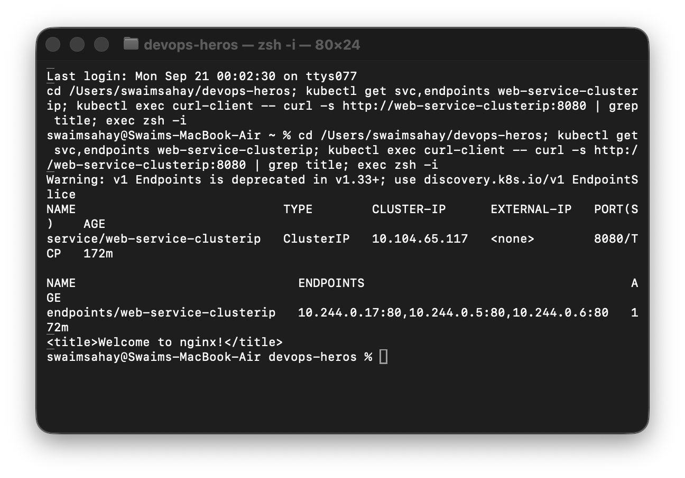

## Task 3 — NodePort

```bash
kubectl apply -f session-11-kubernetes-services/02-nodeport/app-deployment.yaml
kubectl apply -f session-11-kubernetes-services/02-nodeport/service.yaml
kubectl get svc web-service-nodeport
minikube ip
minikube service web-service-nodeport --url
```

The Service output exposes `80:30080/TCP`. With the macOS Docker driver, use the local URL printed by `minikube service` rather than assuming `<minikube-ip>:30080` is reachable from the host.

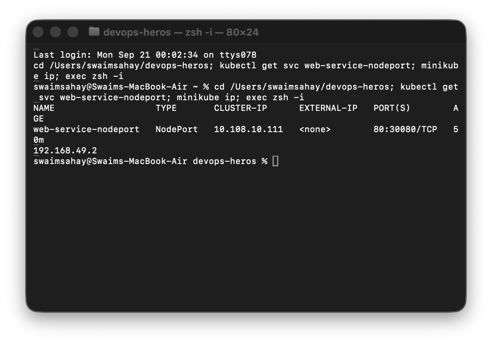

## Task 4 — LoadBalancer

```bash
kubectl apply -f session-11-kubernetes-services/03-loadbalancer/app-deployment.yaml
kubectl apply -f session-11-kubernetes-services/03-loadbalancer/service.yaml
kubectl get svc web-service-loadbalancer
# Keep this running in a second Terminal:
minikube tunnel
kubectl get svc web-service-loadbalancer
```

A LoadBalancer Service also creates the internal ClusterIP and NodePort layers. `minikube tunnel` provides a local route so the `EXTERNAL-IP` can be assigned and tested on port 80.

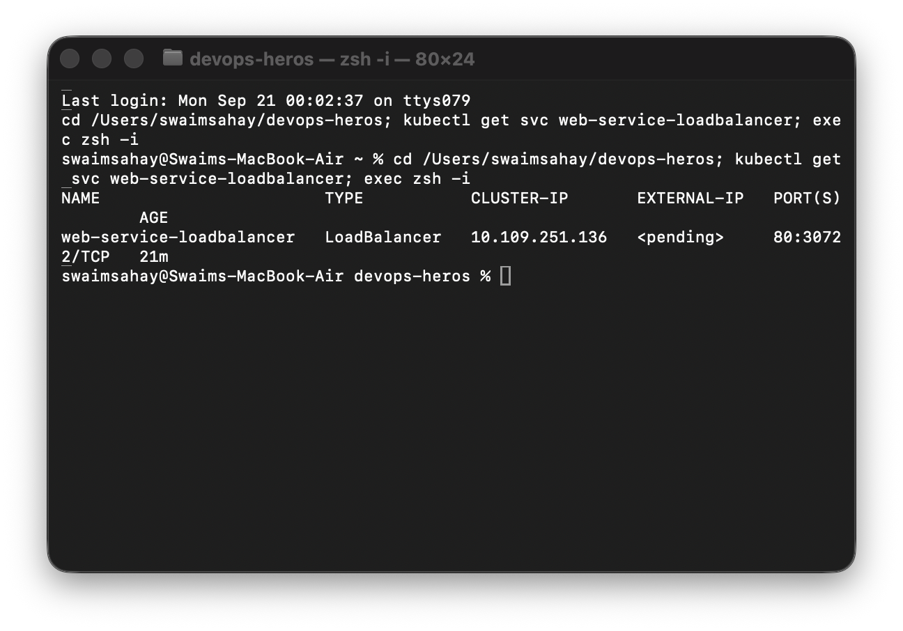

## Task 5 — ExternalName

```bash
kubectl apply -f session-11-kubernetes-services/04-externalname/service.yaml
kubectl apply -f session-11-kubernetes-services/04-externalname/client-pod.yaml
kubectl wait --for=condition=Ready pod/dns-test-client --timeout=90s
kubectl get svc external-database-service
kubectl exec dns-test-client -- nslookup external-database-service
```

An `ExternalName` Service has no ClusterIP, selector, or endpoints. CoreDNS returns a CNAME to the configured external domain.

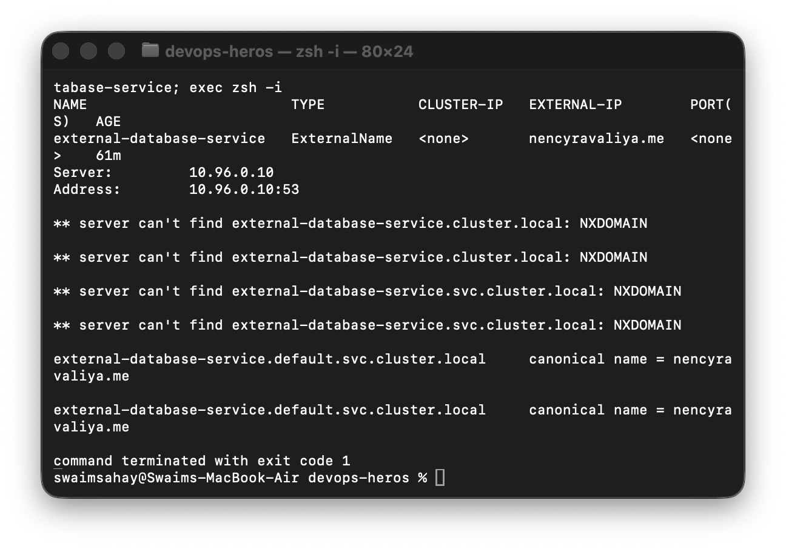

## Task 6 — Headless Service and StatefulSet DNS

```bash
kubectl apply -f session-11-kubernetes-services/05-headless/service.yaml
kubectl apply -f session-11-kubernetes-services/05-headless/app-statefulset.yaml
kubectl apply -f session-11-kubernetes-services/05-headless/client-pod.yaml
kubectl rollout status statefulset/web-stateful --timeout=120s
kubectl get svc web-service-headless
kubectl exec headless-dns-client -- nslookup web-service-headless
kubectl exec headless-dns-client -- nslookup web-stateful-0.web-service-headless.default.svc.cluster.local
```

`clusterIP: None` means no virtual IP: DNS returns individual Pod records. StatefulSet ordinal names (`web-stateful-0`, `-1`, `-2`) are stable and can be addressed directly.

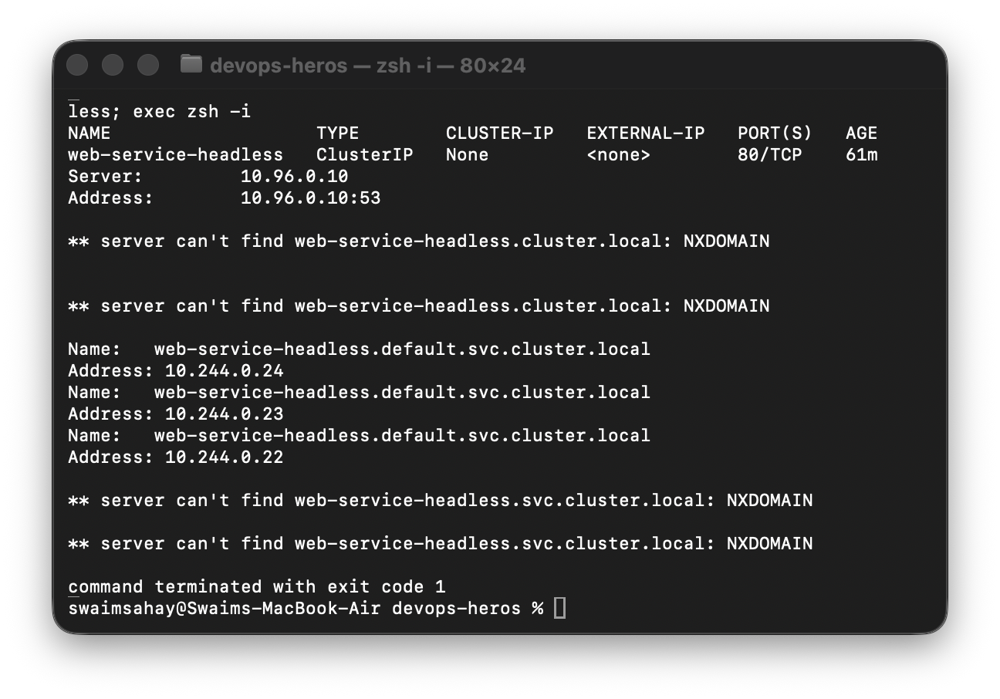

## Task 7 — Service without selector

```bash
kubectl apply -f session-11-kubernetes-services/troubleshooting/empty-endpoints.yaml
kubectl get endpoints external-legacy-db
kubectl apply -f - <<'EOF'
apiVersion: v1
kind: Endpoints
metadata:
  name: external-legacy-db
subsets:
- addresses:
  - ip: 192.168.1.150
  ports:
  - port: 3306
EOF
kubectl get endpoints external-legacy-db
```

The Service initially has no endpoints. The matching manually created Endpoints object maps it to legacy or external infrastructure without using Pod labels.

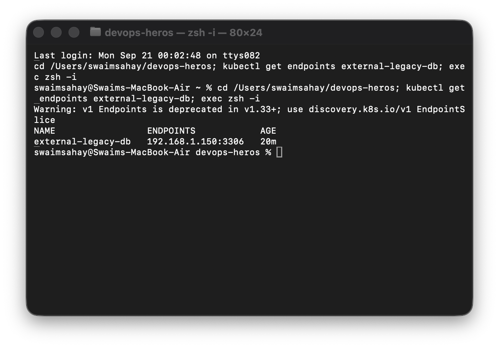

## Task 8 — FQDN and CoreDNS

```bash
kubectl get pods -n kube-system -l k8s-app=kube-dns -o wide
kubectl exec curl-client -- cat /etc/resolv.conf
kubectl exec curl-client -- nslookup web-service-clusterip
kubectl exec curl-client -- nslookup web-service-clusterip.default.svc.cluster.local
kubectl exec curl-client -- nslookup api.github.com
```

The canonical Service name is `<service>.<namespace>.svc.cluster.local`. Search suffixes allow the short name in the same namespace. `ndots:5` can make an external name undergo search-suffix attempts first, adding avoidable DNS lookup latency.

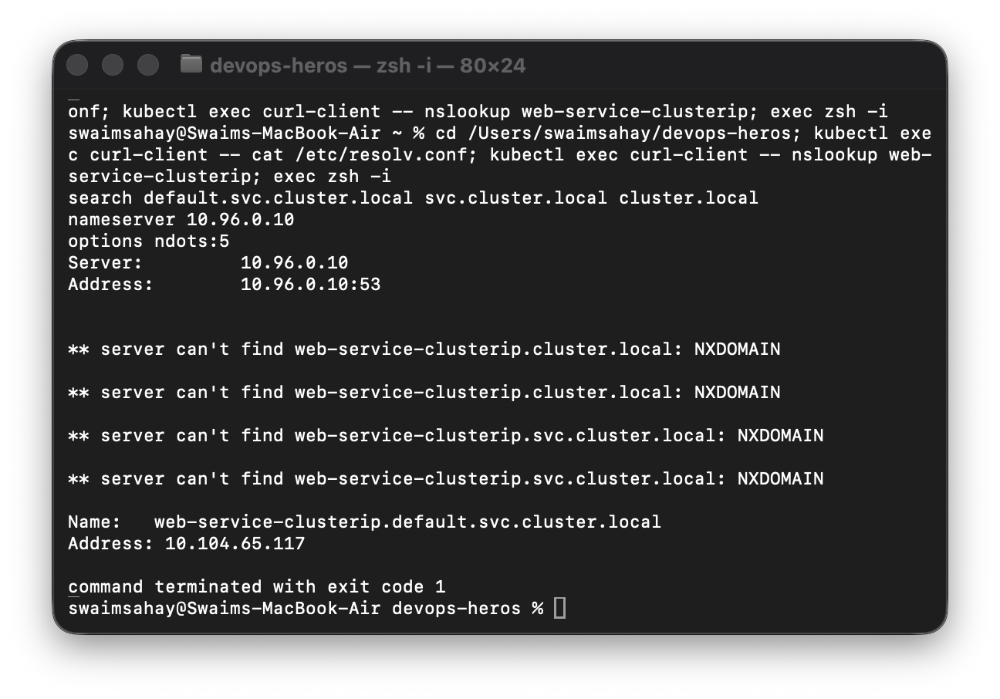

## Task 9 — Stateless versus stateful identity

```bash
kubectl get pods -l app=web-clusterip
kubectl get pods -l app=web-headless
DEPLOY_POD=$(kubectl get pods -l app=web-clusterip -o jsonpath='{.items[0].metadata.name}')
kubectl delete pod "$DEPLOY_POD"
kubectl delete pod web-stateful-0
kubectl get pods -l app=web-clusterip
kubectl get pods -l app=web-headless
```

A Deployment replacement has a fresh random suffix. A StatefulSet recreates the same ordinal identity, `web-stateful-0`.

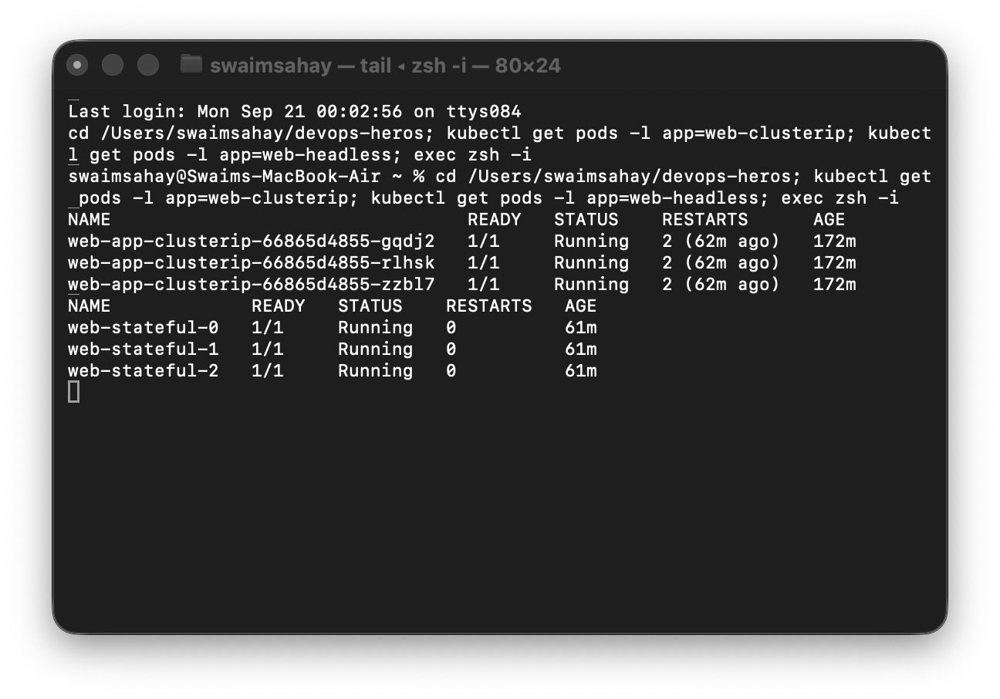

## Task 10 — Controller architecture matrix

| Property | Deployment | StatefulSet | DaemonSet |
| --- | --- | --- | --- |
| Workload | Stateless APIs/web apps | Databases and ordered systems | Node agents |
| Identity | Disposable random Pod name | Stable ordinal, hostname and identity | One Pod tied to each eligible node |
| Ordering | Parallel by default | Ordered create/delete | Parallel across nodes |
| Storage | Ephemeral/shared as needed | `volumeClaimTemplates` per ordinal | Often hostPath/node-local |
| Discovery | ClusterIP, NodePort, LoadBalancer | Headless Service | Usually none or ClusterIP |
| Scaling | Explicit replica count | Ordered tail scaling | Automatically follows node count |

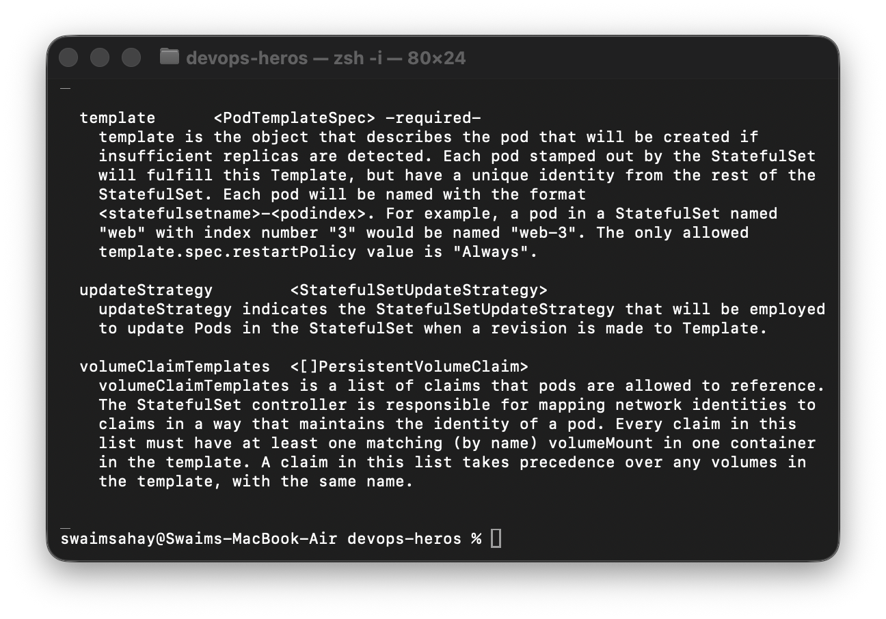

## Task 11 — Service-selection and cost

```text
Internal-only workload? → ClusterIP
Need development/bare-metal access? → NodePort
Need L7 routes for many HTTP services? → Ingress + one LoadBalancer
Need one public cloud endpoint for one service? → LoadBalancer
Need DNS alias to external system? → ExternalName
Need direct stateful Pod discovery? → Headless
```

Creating a cloud LoadBalancer per microservice increases recurring cost and operational surface. The standard production pattern is one LoadBalancer-backed Ingress Controller routing to many internal ClusterIP Services.

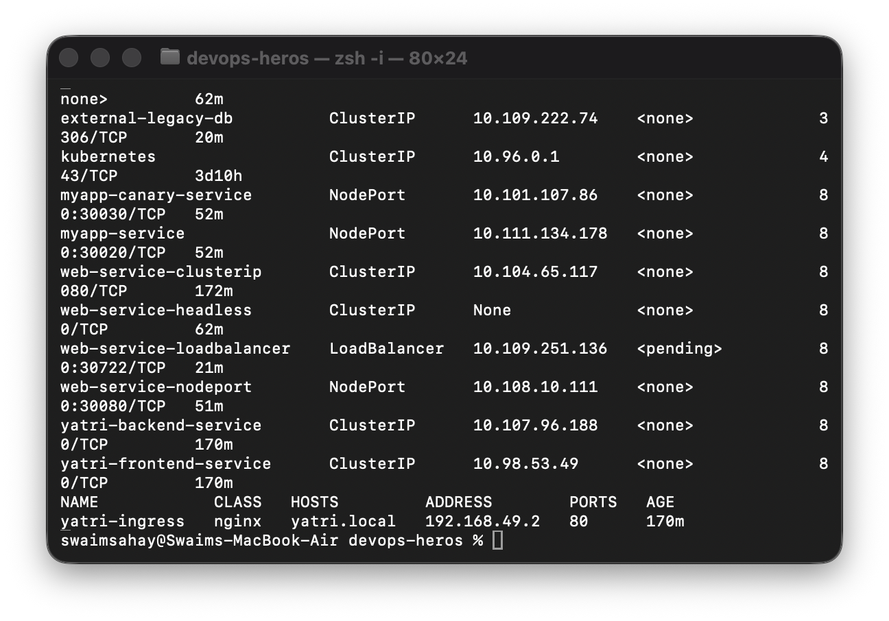

## Task 12 — Minikube Docker-driver gotcha

```bash
MINIKUBE_IP=$(minikube ip)
curl -I "http://${MINIKUBE_IP}:30080" || true
minikube service web-service-nodeport --url
# For LoadBalancer/Ingress routes:
minikube tunnel
```

With the Docker driver, Minikube runs behind an isolated container bridge on macOS/Windows and often cannot expose `<node-ip>:NodePort` directly to the host. `minikube service --url` creates a reachable local proxy; `minikube tunnel` installs a Layer-3 route for LoadBalancer and ingress access.

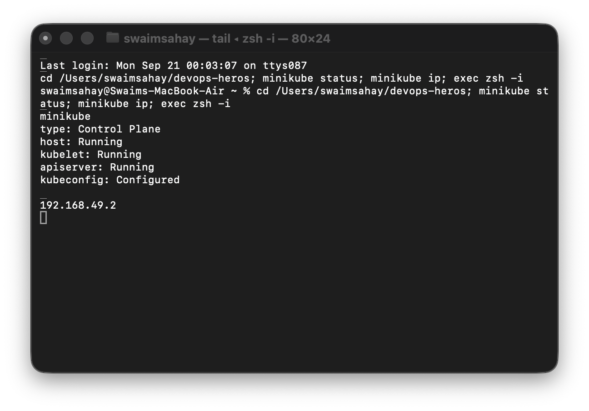
