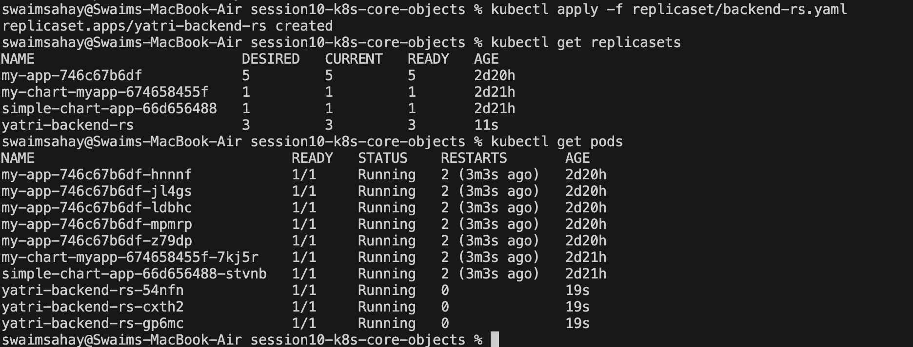
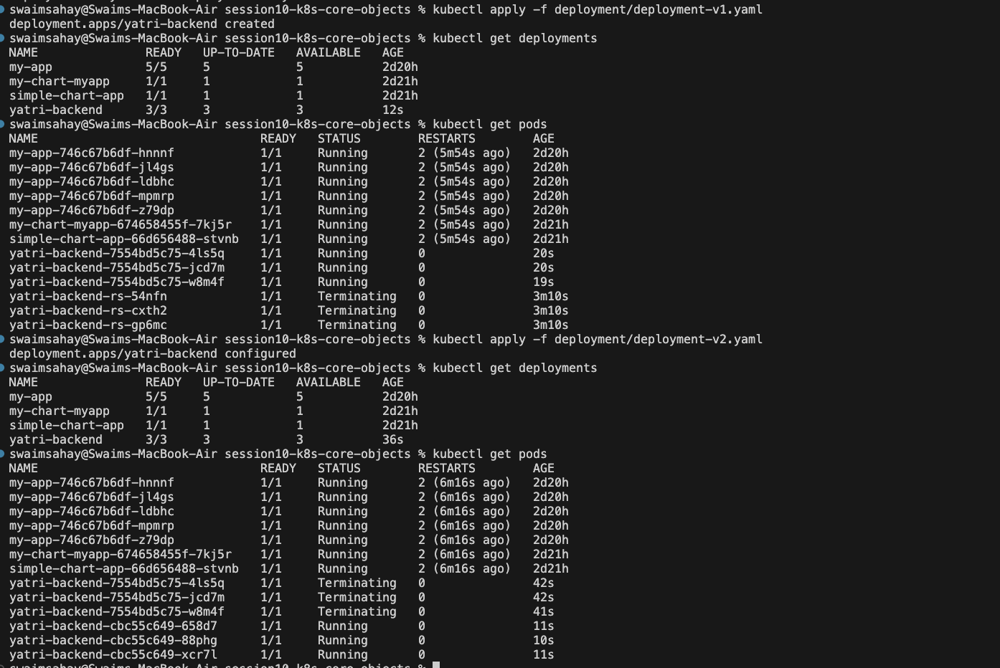
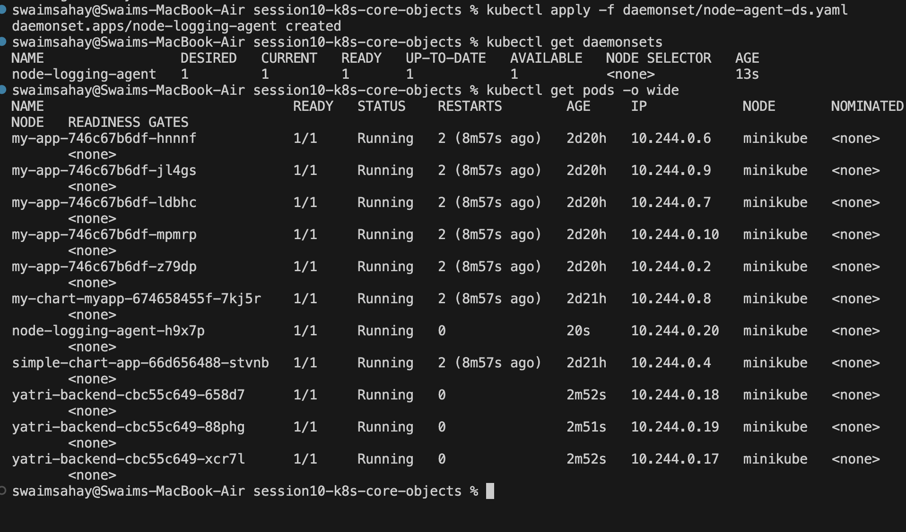
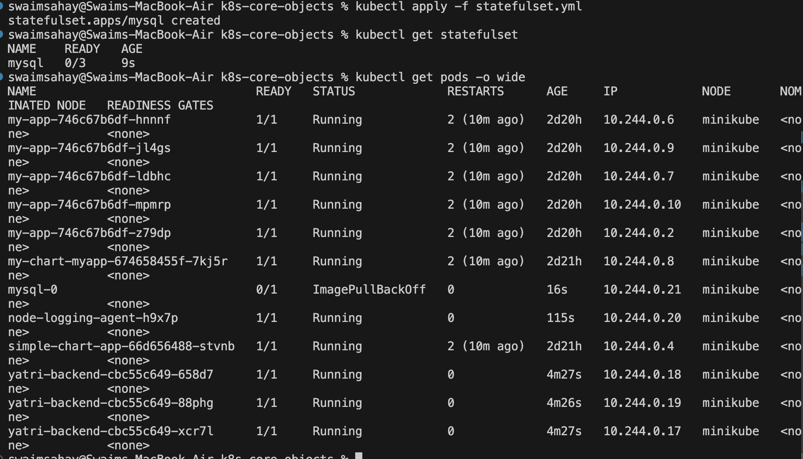

# Kubernetes Workloads Assignment

This document outlines the deployment and analysis of core Kubernetes workload objects. It details the purpose of each controller and provides execution logs verifying their deployment.

## 1. ReplicaSet

**What is a ReplicaSet?**  
A ReplicaSet's primary purpose is to maintain a stable set of replica Pods running at any given time. It guarantees the availability of a specified number of identical Pods to ensure your application has enough resources to handle the load. While ReplicaSets can be created directly, they are typically managed by a `Deployment` rather than being manipulated manually.

### Execution

## 2. Deployment

**What is a Deployment?**  
A Deployment provides declarative updates for Pods and ReplicaSets. You define a desired state (e.g., "I want 3 instances of this Nginx container running"), and the Deployment Controller changes the actual cluster state to match the desired state at a controlled rate. Deployments abstract away the manual management of ReplicaSets and enable critical production features like zero-downtime rolling updates, pausing rollouts, and version rollbacks.

### Execution

## 3. DaemonSet

**What is a DaemonSet?**  
A DaemonSet ensures that all (or some specified subset of) worker Nodes in a Kubernetes cluster run exactly one copy of a specific Pod. As new nodes are added to the cluster, Pods are dynamically added to them. As nodes are removed, those Pods are safely garbage collected.

**Where is it used?**  
DaemonSets are heavily used for cluster-wide infrastructure and maintenance services that must run continuously on every node, such as:

- Log collection daemons, e.g., Fluentd, Logstash, or Promtail.
- Node monitoring daemons, e.g., Prometheus Node Exporter or Datadog agents.
- Cluster storage daemons, e.g., GlusterFS or Ceph.

### Execution

## 4. StatefulSet

**What is a StatefulSet?**  
Unlike Deployments, which manage stateless Pods that are entirely interchangeable and disposable, a StatefulSet manages the deployment and scaling of a set of Pods while providing strict guarantees about their ordering and uniqueness. Each Pod in a StatefulSet derives a persistent, sticky identity (e.g., `db-0`, `db-1`, `db-2`) that it maintains across restarts and rescheduling.

**Where is it used?**  
StatefulSets are used for stateful applications that require one or more of the following:

- Stable, unique network identifiers: Each Pod can be reached via a consistent DNS name.
- Stable, persistent storage: If a Pod dies, it reconnects to the exact same Persistent Volume upon restarting.
- Ordered, graceful deployment and scaling.
- Ordered, automated rolling updates.

**Common Use Cases:**  
Distributed databases such as Cassandra, MongoDB clusters, MySQL clusters, message brokers such as Kafka and RabbitMQ, and distributed key-value stores such as ZooKeeper and Redis.

### Execution

