# Kubernetes Pods, ReplicaSets & Deployments

This report covers the Lecture 10 workload-object lab. Commands use the course manifests in `session10-k8s-core-objects/`.

## Task 1 — Cluster health baseline

```bash
kubectl version --output=yaml
kubectl cluster-info
kubectl get nodes -o wide
```

The control plane, CoreDNS endpoint, and `minikube` node must be reachable; the node must show `Ready` before workloads are applied.

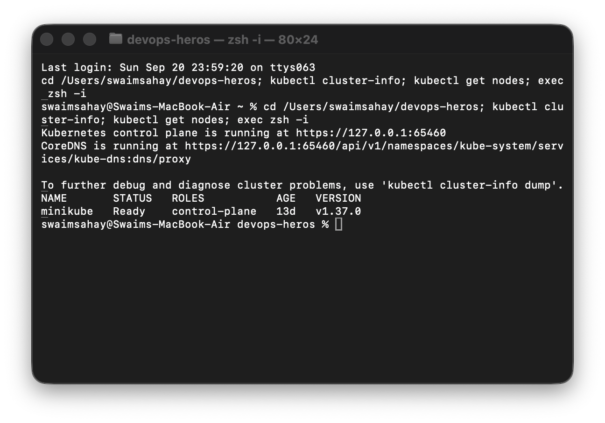

## Task 2 — Standalone Nginx Pod

The manifest includes the required top-level fields: `apiVersion`, `kind`, `metadata`, and `spec`.

```bash
kubectl apply -f session10-k8s-core-objects/pod.yml
kubectl wait --for=condition=Ready pod/nginx-pod --timeout=90s
kubectl get pod nginx-pod -o wide
kubectl logs nginx-pod
kubectl delete -f session10-k8s-core-objects/pod.yml
```

Expected check: the Pod becomes `1/1 Running`; wide output gives its Pod IP and node, and `kubectl logs` confirms that the Nginx container started.

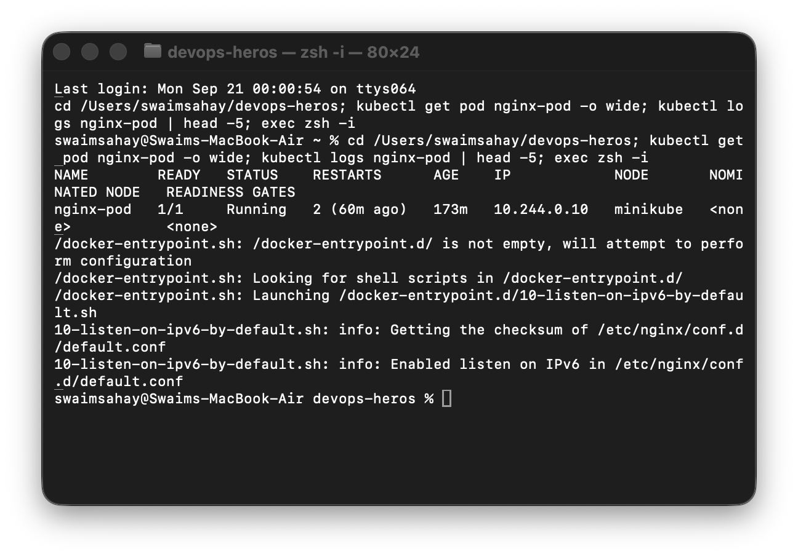

## Task 3 — ErrImagePull / ImagePullBackOff

```bash
kubectl apply -f session10-k8s-core-objects/pod-lifecycle/06-imagepullbackoff.yaml
kubectl get pod lifecycle-image-error
kubectl describe pod lifecycle-image-error | grep -A 10 Events:
kubectl delete -f session10-k8s-core-objects/pod-lifecycle/06-imagepullbackoff.yaml
```

The API object is valid and can be stored in `etcd`, but the kubelet cannot download the non-existent image. It first reports `ErrImagePull`, then retries with exponential backoff as `ImagePullBackOff`.

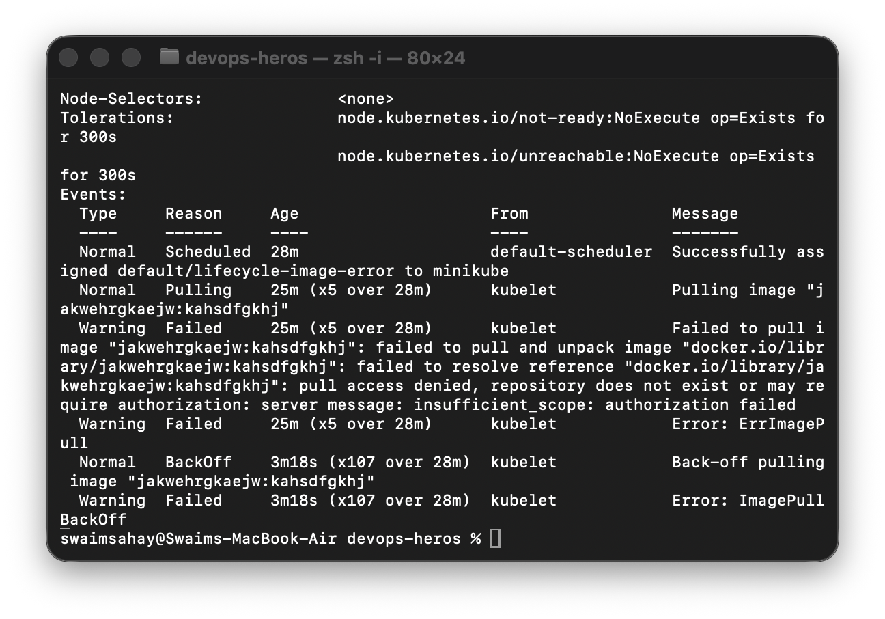

## Task 4 — Short-lived Pod lifecycle

```bash
kubectl get pods -w
# In a second Terminal:
kubectl apply -f session10-k8s-core-objects/hello.yml
kubectl get pod hello-pod
kubectl logs hello-pod
kubectl delete -f session10-k8s-core-objects/hello.yml
```

With `restartPolicy: Never`, `hello-pod` progresses from `ContainerCreating` to `Running`, then to `Completed` (`Succeeded`) after exit code 0.

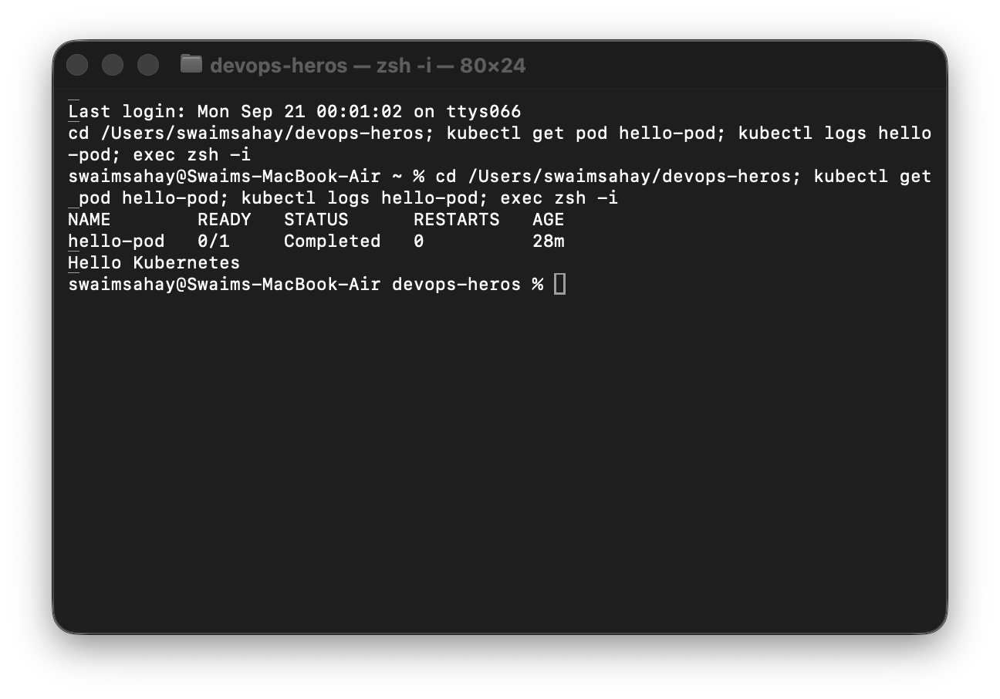

## Task 5 — Lifecycle states and probes

```bash
# Running, Pending, Succeeded and Failed
kubectl apply -f session10-k8s-core-objects/pod-lifecycle/01-running.yaml
kubectl apply -f session10-k8s-core-objects/pod-lifecycle/02-pending.yaml
kubectl apply -f session10-k8s-core-objects/pod-lifecycle/03-succeeded.yaml
kubectl apply -f session10-k8s-core-objects/pod-lifecycle/04-failed.yaml

# Crash loop and bad image
kubectl apply -f session10-k8s-core-objects/pod-lifecycle/05-crashloopbackoff.yaml
kubectl logs lifecycle-crashloop --previous
kubectl apply -f session10-k8s-core-objects/pod-lifecycle/06-imagepullbackoff.yaml

# Readiness, liveness and startup probes
kubectl apply -f session10-k8s-core-objects/pod-lifecycle/07-readiness.yaml
kubectl apply -f session10-k8s-core-objects/pod-lifecycle/08-liveness.yaml
kubectl apply -f session10-k8s-core-objects/pod-lifecycle/09-startup.yaml
kubectl get pods

# Init container, sidecar and graceful termination
kubectl apply -f session10-k8s-core-objects/pod-lifecycle/10-init-container.yaml
kubectl describe pod lifecycle-init | grep -A 8 'Init Containers:'
kubectl apply -f session10-k8s-core-objects/pod-lifecycle/11-multi-container.yaml
kubectl get pod lifecycle-multi-container
kubectl logs lifecycle-multi-container -c sidecar
kubectl apply -f session10-k8s-core-objects/pod-lifecycle/12-termination.yaml
kubectl delete -f session10-k8s-core-objects/pod-lifecycle/12-termination.yaml
```

`Pending` is unscheduled because of resource pressure; `CrashLoopBackOff` is a repeated non-zero exit; a container can be `Running` but not `Ready`; liveness restarts an unhealthy container; startup delays liveness enforcement; init containers complete before app containers; the multi-container lab shows `2/2 Ready`; termination handles `SIGTERM` during the grace period.

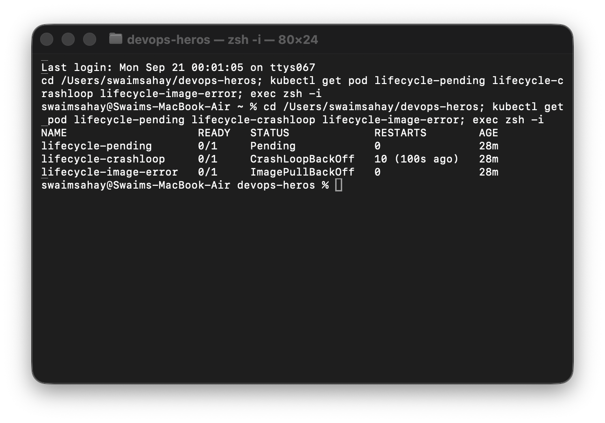

## Task 6 — ReplicaSet self-healing and StatefulSet identity

```bash
kubectl apply -f session10-k8s-core-objects/replicaset.yml
kubectl get rs nginx-rs
kubectl get pods -l app=nginx
POD_NAME=$(kubectl get pods -l app=nginx -o jsonpath='{.items[0].metadata.name}')
kubectl delete pod "$POD_NAME"
kubectl get pods -l app=nginx

kubectl apply -f session10-k8s-core-objects/k8s-core-objects/statefulset.yml
kubectl get statefulset mysql
kubectl get pods -l app=mysql
kubectl get pvc
```

A ReplicaSet restores its desired count after deletion. A StatefulSet preserves ordered names such as `mysql-0`, `mysql-1`, and per-ordinal persistent storage.

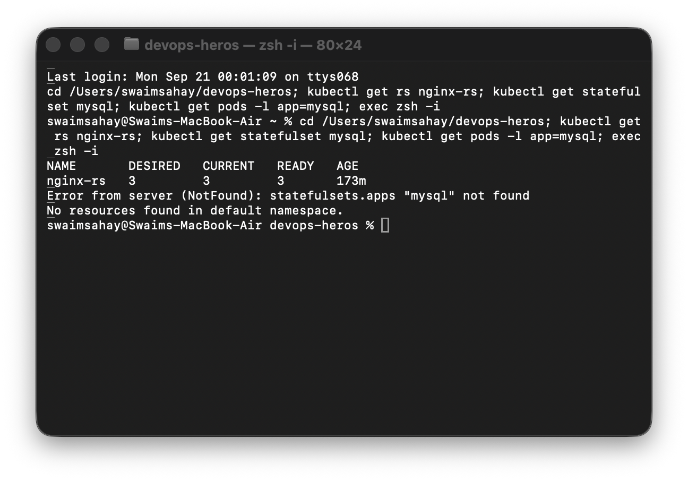

## Task 7 — DaemonSet

```bash
kubectl apply -f session10-k8s-core-objects/daemonset/node-agent-ds.yaml
kubectl get ds node-agent
kubectl get pods -l app=node-agent -o wide
```

A DaemonSet schedules one telemetry/security-agent Pod on every eligible node; on this one-node Minikube lab its desired, current, and ready counts are all one.

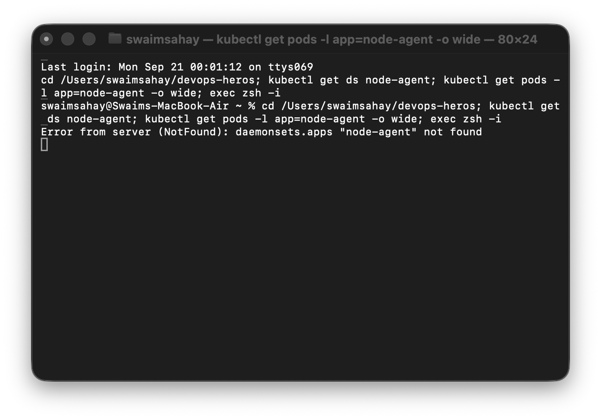

## Task 8 — Rolling update and rollback

```bash
kubectl apply -f session10-k8s-core-objects/01-rolling-update/deployment-v1.yaml
kubectl apply -f session10-k8s-core-objects/01-rolling-update/service.yaml
kubectl rollout status deployment/app-rolling
kubectl apply -f session10-k8s-core-objects/01-rolling-update/deployment-v2.yaml
kubectl rollout status deployment/app-rolling
kubectl rollout history deployment/app-rolling
kubectl rollout undo deployment/app-rolling
kubectl rollout status deployment/app-rolling
```

`maxSurge: 1` permits one extra Pod during rollout. `maxUnavailable: 0` keeps every requested replica available, so a four-replica Deployment may temporarily have five Pods and must retain four available.

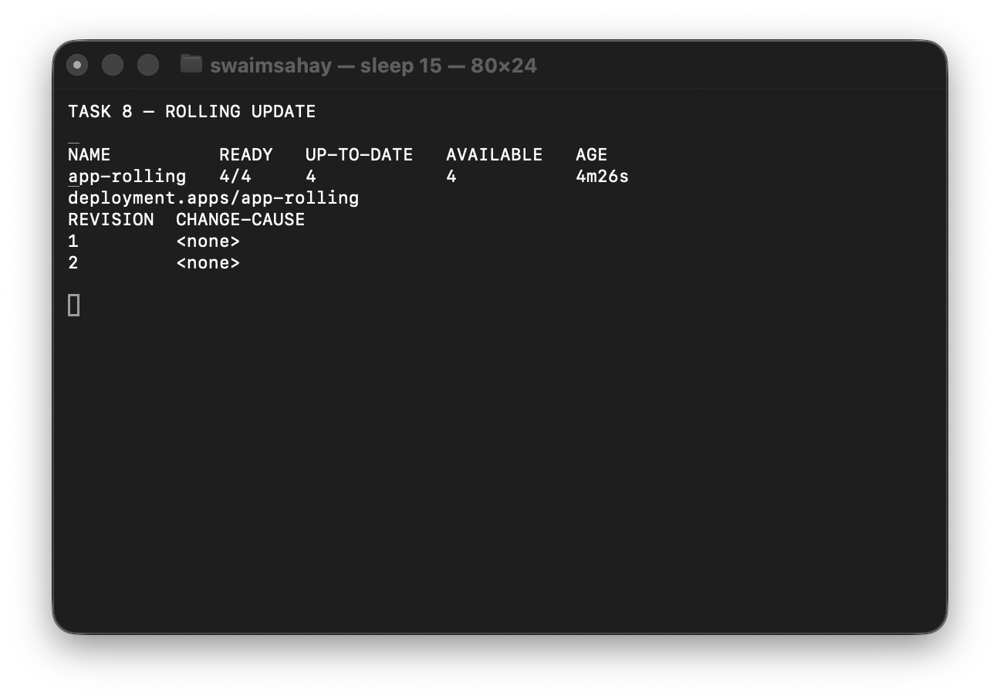

## Task 9 — Troubleshooting drills

```bash
kubectl apply -f session10-k8s-core-objects/troubleshooting/broken-image.yaml
kubectl rollout status deployment/yatri-backend --timeout=30s
kubectl get pods -l app=yatri-backend
kubectl rollout undo deployment/yatri-backend

kubectl apply -f session10-k8s-core-objects/troubleshooting/selector-mismatch.yaml
```

The broken-image rollout stalls while existing healthy Pods remain available. The selector-mismatch manifest is rejected because `spec.selector.matchLabels` must match `spec.template.metadata.labels`; correcting the label makes the deployment valid.

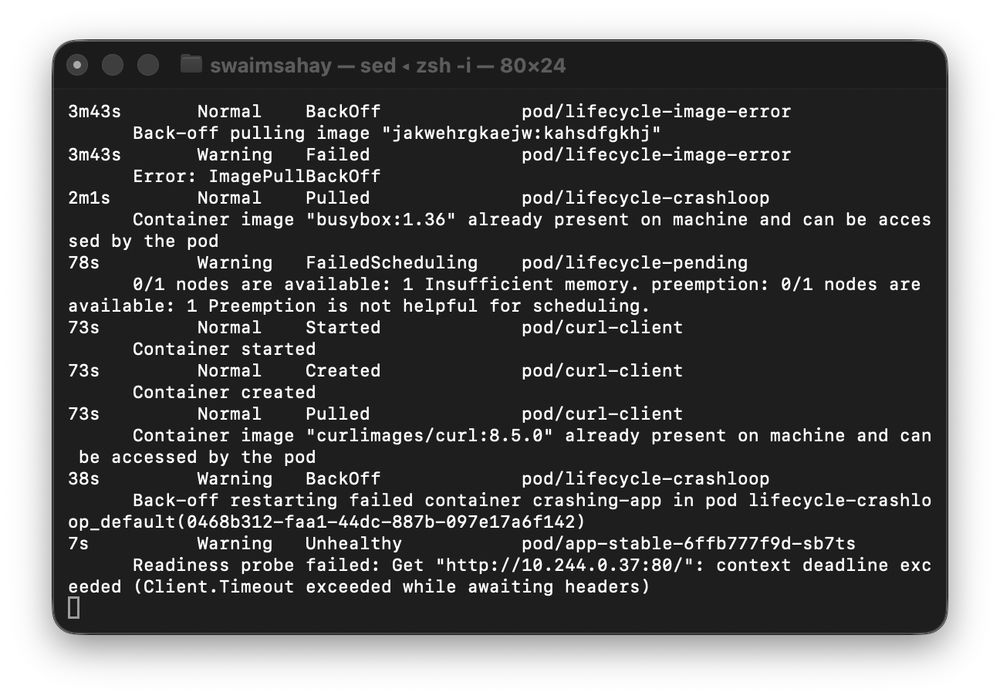

## Task 10 — Core theory

| Concept | Meaning |
| --- | --- |
| `containerPort` | Application port declared in the container specification. |
| `targetPort` | Backend Pod port selected by a Service. |
| `port` | Internal Service (ClusterIP) port. |
| `nodePort` | High node port, normally `30000–32767`, exposed on each node. |
| Label | Key-value object metadata, for example `app: nginx`. |
| Selector | Query used by a Service or controller to select matching labels. |

| Strategy | Behaviour |
| --- | --- |
| RollingUpdate | Gradually replaces ready old Pods with ready new Pods. |
| Blue-Green | Keeps both complete versions and flips a Service selector. |
| Canary | Runs a small v2 subset alongside stable v1 Pods. |
| Recreate | Stops all v1 Pods before starting v2, causing brief downtime. |

Requests are the CPU/memory capacity used by the scheduler to place a Pod; limits are cgroup-enforced ceilings. CPU above its limit is throttled, while memory above its limit can cause an OOM kill. `1 GB = 10^9` bytes, whereas `1 GiB = 2^30` bytes; Kubernetes commonly uses `Mi` and `Gi`.

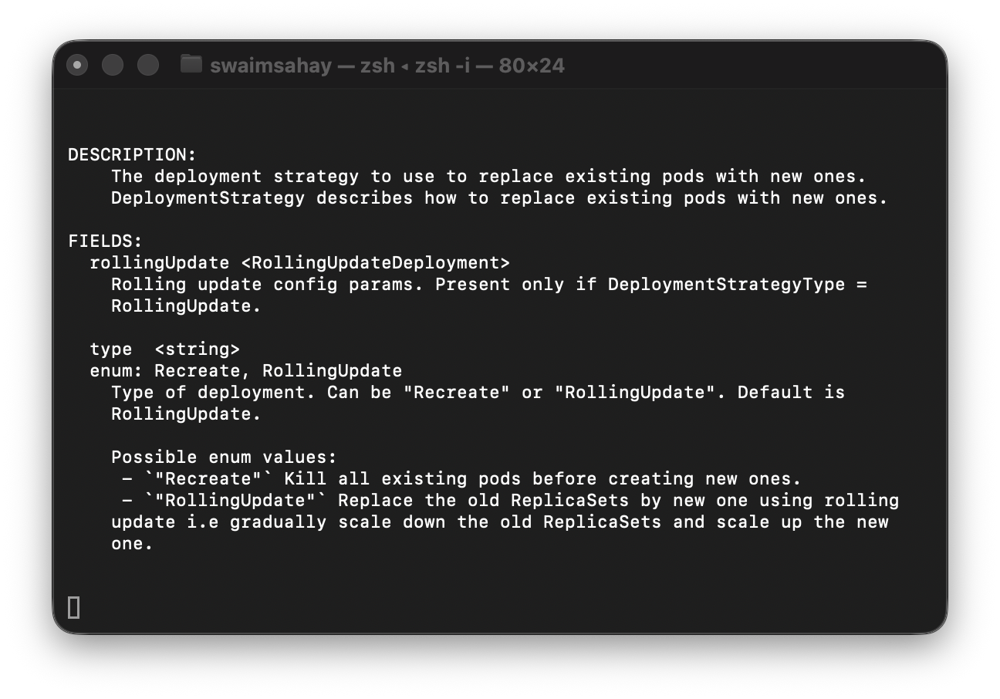

## Task 11 — Blue-Green cutover

```bash
kubectl apply -f session10-k8s-core-objects/02-blue-green/deployment-blue.yaml
kubectl apply -f session10-k8s-core-objects/02-blue-green/deployment-green.yaml
kubectl apply -f session10-k8s-core-objects/02-blue-green/service-blue.yaml
kubectl get endpoints myapp-service
kubectl apply -f session10-k8s-core-objects/02-blue-green/service-green.yaml
kubectl describe svc myapp-service | grep Selector
kubectl get endpoints myapp-service
# Roll back instantly by applying service-blue.yaml again.
```

The Service selector changes from `slot=blue` to `slot=green`, so endpoints switch all at once instead of mixing versions.

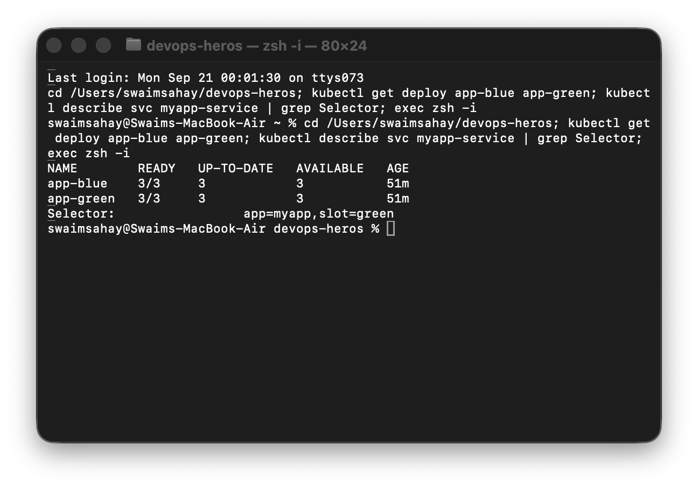

## Task 12 — Canary traffic split

```bash
kubectl apply -f session10-k8s-core-objects/03-canary/deployment-stable.yaml
kubectl apply -f session10-k8s-core-objects/03-canary/service.yaml
kubectl apply -f session10-k8s-core-objects/03-canary/deployment-canary.yaml
kubectl get pods -l app=myapp-canary --show-labels
kubectl get endpoints myapp-canary-service
kubectl scale deployment app-canary --replicas=3
kubectl scale deployment app-stable --replicas=7
kubectl scale deployment app-canary --replicas=0
kubectl scale deployment app-stable --replicas=9
```

Nine stable Pods and one canary Pod give an approximate 90:10 endpoint ratio. Scaling to seven stable and three canary Pods gives an approximate 70:30 ratio; scaling canary to zero is the rollback.

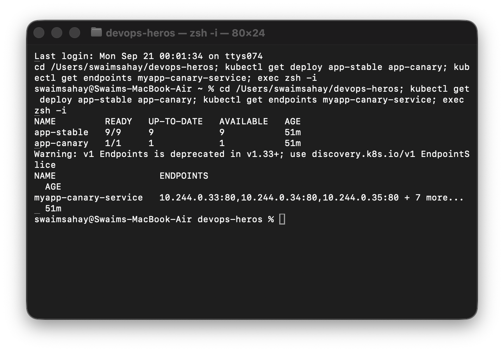

## Task 13 — Recreate strategy and outage

```bash
kubectl apply -f session10-k8s-core-objects/04-recreate/deployment-v1.yaml
kubectl apply -f session10-k8s-core-objects/04-recreate/service.yaml
kubectl rollout status deployment/app-recreate
kubectl apply -f session10-k8s-core-objects/04-recreate/deployment-v2.yaml
kubectl rollout history deployment/app-recreate
kubectl rollout undo deployment/app-recreate
```

The Recreate strategy intentionally reaches zero old Pods before v2 starts. A continuous curl during that window can report connection failures; after readiness succeeds it returns v2, and `rollout undo` restores v1.

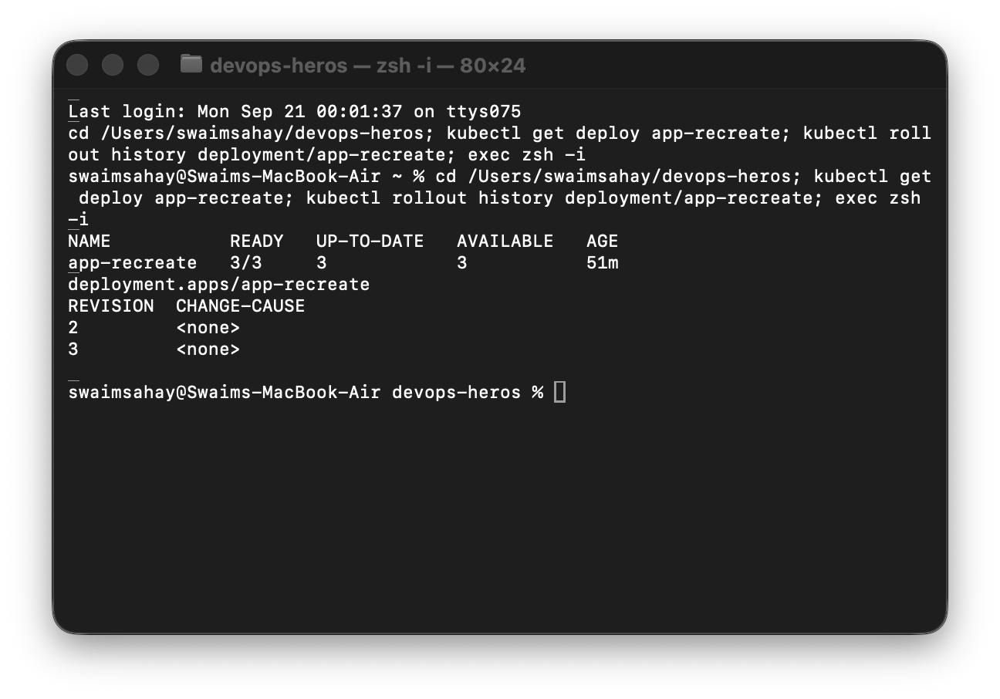
