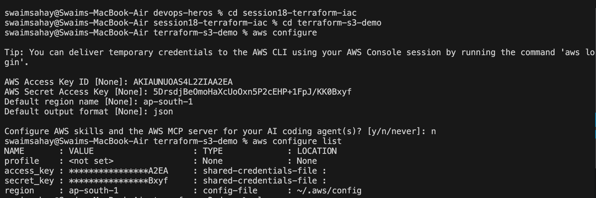
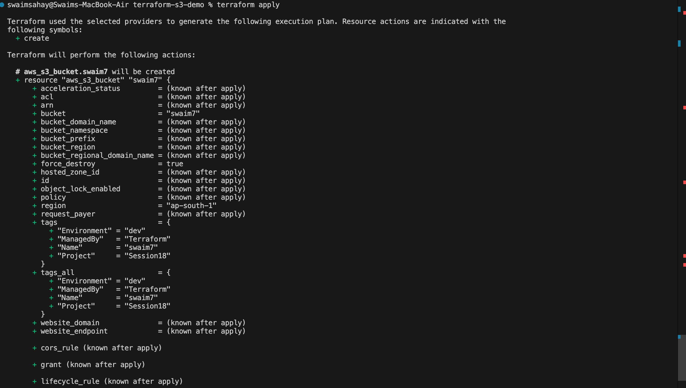
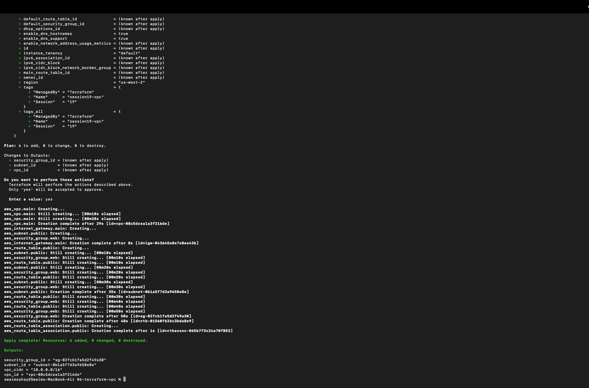
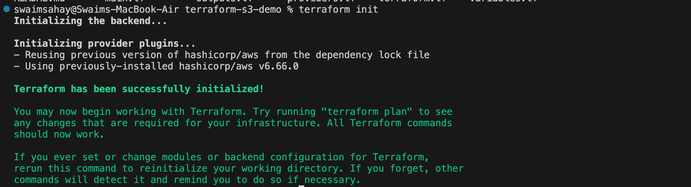
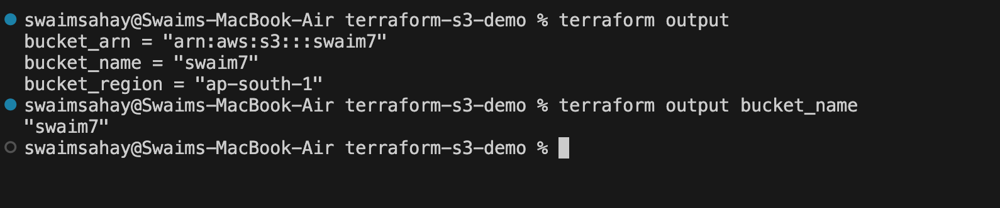
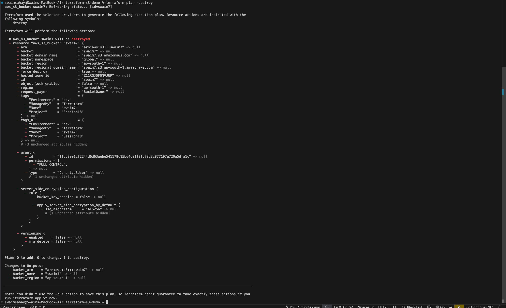
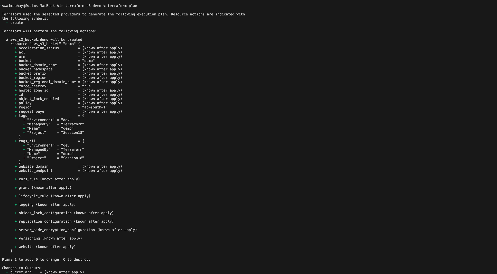
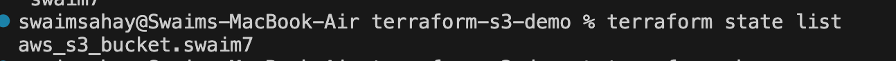
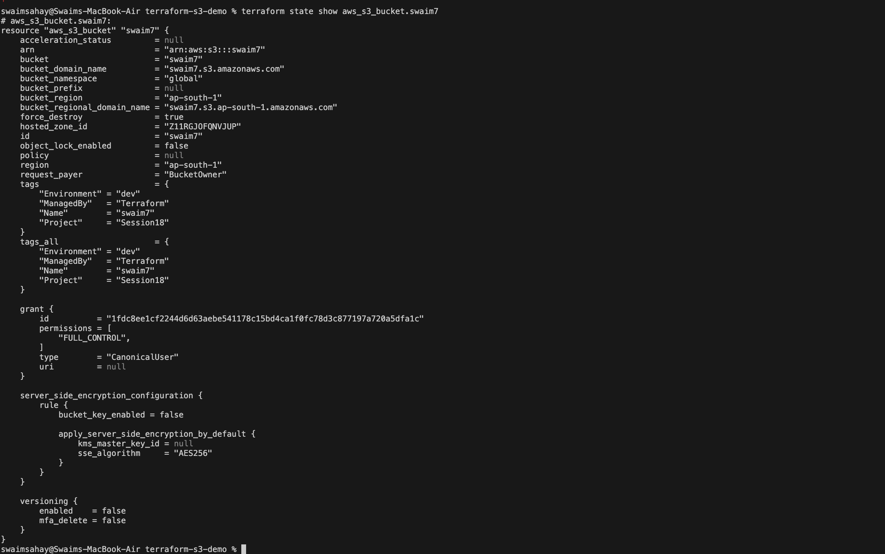

# Terraform and AWS Command Reference

## AWS Configure

## Terraform Apply

## Terraform Destroy

## Terraform Format and Validate

## Terraform Init

## Terraform Output

## Terraform Plan Destroy

## Terraform Plan

## Terraform State List

## Terraform State Show

