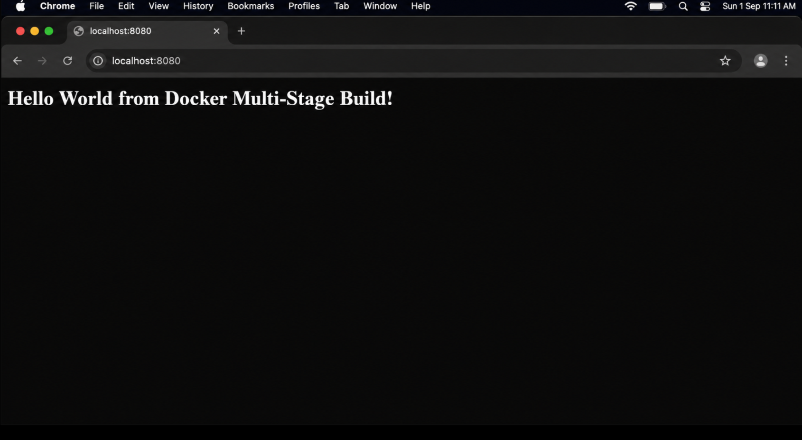
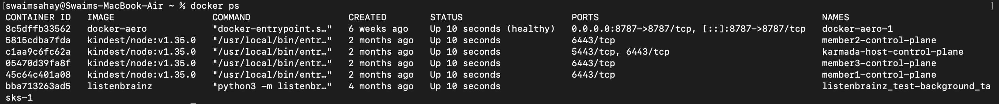
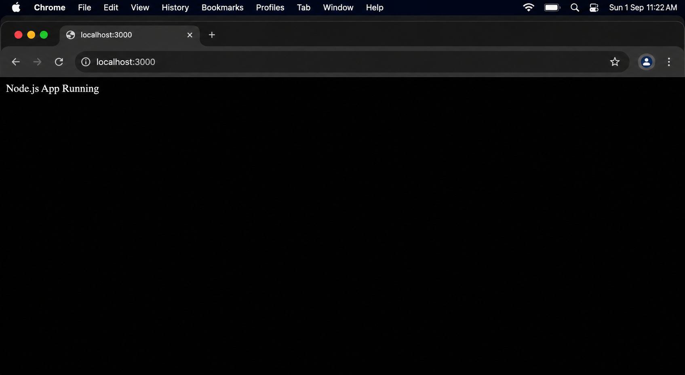
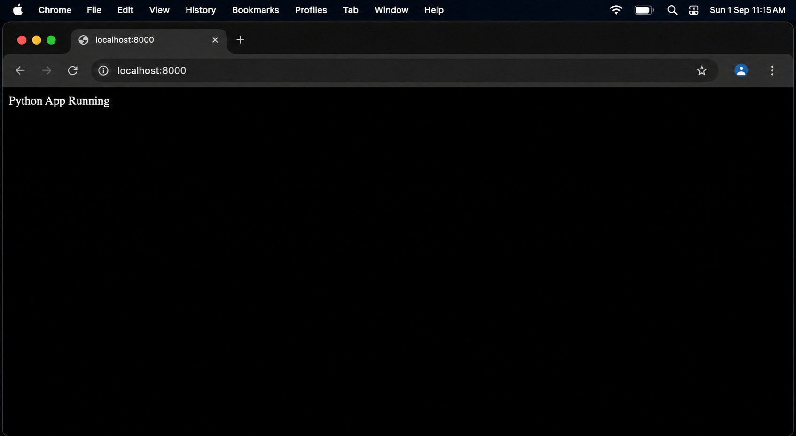
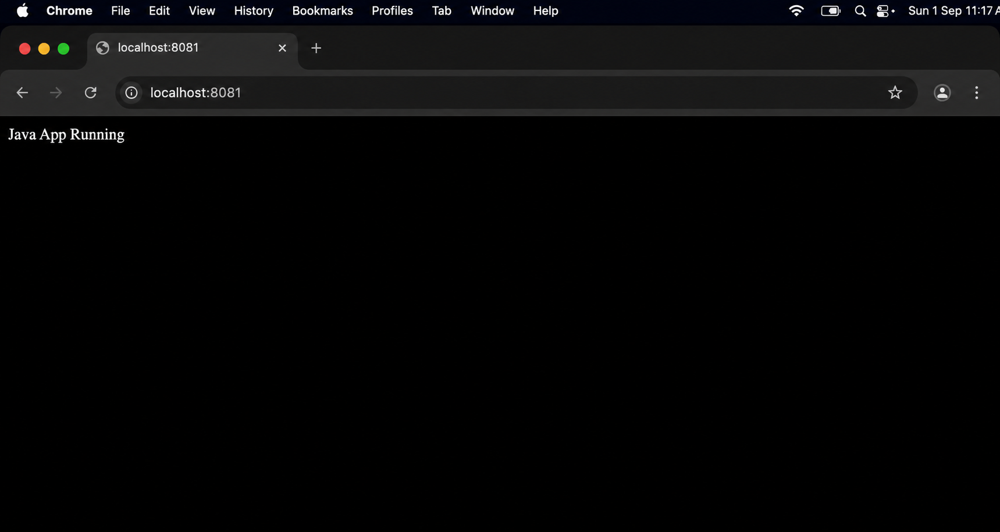

# Docker Multi-Stage Build & Deployment Assignment

**Name:** Swaim Sahay
**Enrollment Number:** 24BCS10335

---

## Task 1 & 2: Multi-Stage Dockerfile Execution

The repository containing the multi-stage Dockerfile was successfully cloned, built, and executed. The multi-stage build optimized the final image size by discarding build dependencies and only transferring the compiled binary/artifacts to the final production image.

### Build and Run Commands Used

```bash
docker build -t multi-stage-hello .
docker run -d -p 8080:8080 --name multi-stage-container multi-stage-hello
```


---

## Verification 1: Application Output

The application successfully serves the required text on port 8080.

### Application Running




---

## Verification 2: Docker PS

The container is running correctly with the port mapping established (Host 8080 → Container 8080).

### Docker PS Output




---

## Task 3: Docker Application Deployments

To demonstrate the versatility of Docker, three distinct technology stacks were deployed in isolated containers.

---

### 1. Node.js Deployment

A lightweight Alpine Node.js image running an HTTP server.

#### Command

```bash
docker run -d --name node-app -p 3000:3000 node:alpine sh -c "npm install -g http-server && echo 'Node.js App Running' > index.html && http-server -p 3000"
```

#### Proof of Execution




---

### 2. Python Deployment

An Alpine Python image utilizing the built-in `http.server` module.

#### Command

```bash
docker run -d --name python-app -p 8000:8000 python:alpine sh -c "echo 'Python App Running' > index.html && python -m http.server 8000"
```

#### Proof of Execution




---

### 3. Java Deployment

A lightweight Alpine JDK 21 image utilizing Java's built-in Simple Web Server (`jwebserver`).

#### Command

```bash
docker run -d --name java-app -p 8081:8081 eclipse-temurin:21-alpine sh -c "echo 'Java App Running' > index.html && jwebserver -p 8081 -b 0.0.0.0"
```

#### Proof of Execution




---