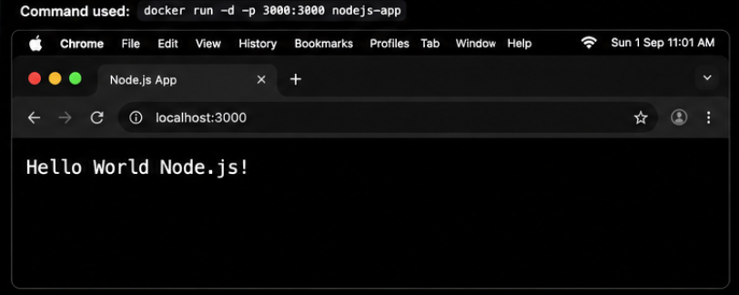
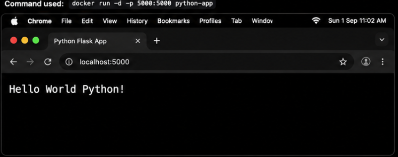
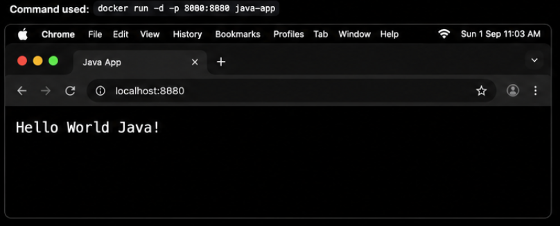
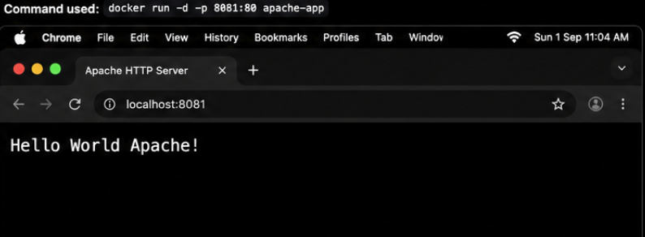
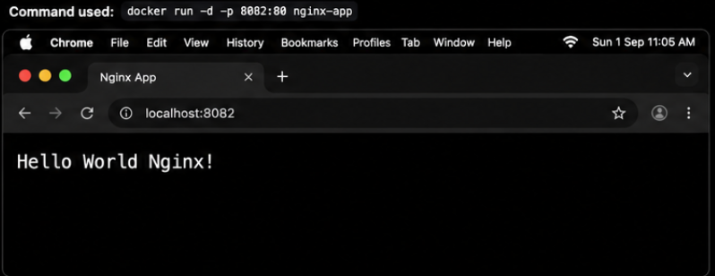
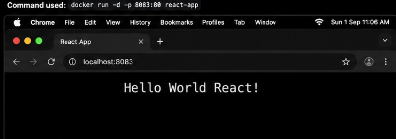

# Docker Hello World Applications

This repository contains 6 simple "Hello World" web applications, each containerized using Docker. This project demonstrates how to write `Dockerfile`s, build images, and run containers across various technology stacks and web servers.

---

## Repository Structure

- `nodejs-app/`: A native Node.js HTTP server.
- `python-app/`: A Python web application utilizing the Flask framework.
- `java-app/`: A compiled Java HTTP server using standard JDK libraries.
- `Apache-app/`: A static HTML page served by the Apache HTTP Server (`httpd`).
- `React-app/`: A React front-end application built with Vite, served via an Nginx multi-stage build.
- `nginx-app/`: A static HTML page served directly by an Nginx web server.

---

## Port Mappings

Once running, the applications are mapped to the following local ports on the host machine:

| Application | Container Port | Host Port | Local URL |
|-------------|----------------|-----------|-----------|
| Node.js     | 3000           | 3000      | `http://localhost:3000` |
| Python (Flask) | 5000        | 5000      | `http://localhost:5000` |
| Java        | 8080           | 8080      | `http://localhost:8080` |
| Apache      | 80             | 8081      | `http://localhost:8081` |
| Nginx       | 80             | 8082      | `http://localhost:8082` |
| React       | 80             | 8083      | `http://localhost:8083` |

---

## Execution & Proof of Learning

### 1. Node.js Application

**Command Used**

```bash
docker run -d -p 3000:3000 nodejs-app
```

### Output




### 2. Python Application

**Command Used**

```bash
docker run -d -p 5000:5000 python-app
```

### Output




### 3. Java Application

**Command Used**

```bash
docker run -d -p 8080:8080 java-app
```

### Output




### 4. Apache Application

**Command Used**

```bash
docker run -d -p 8081:80 apache-app
```

### Output




### 5. Nginx Application

**Command Used**

```bash
docker run -d -p 8082:80 nginx-app
```

### Output




### 6. React Application

**Command Used**

```bash
docker run -d -p 8083:80 react-app
```

### Output




---