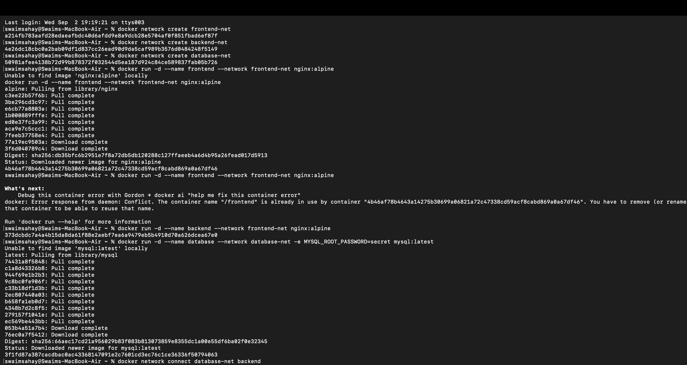
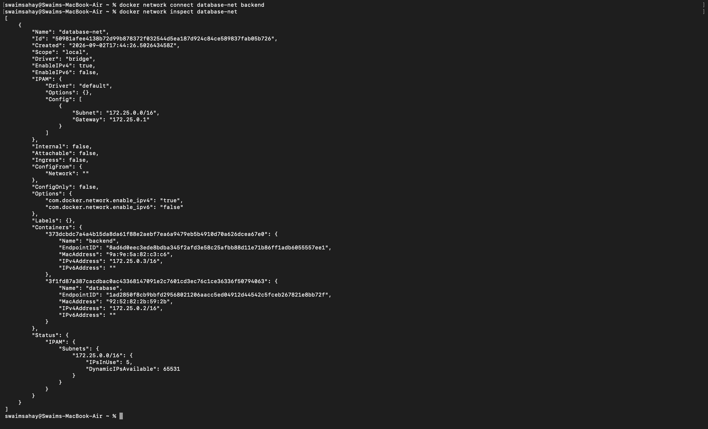
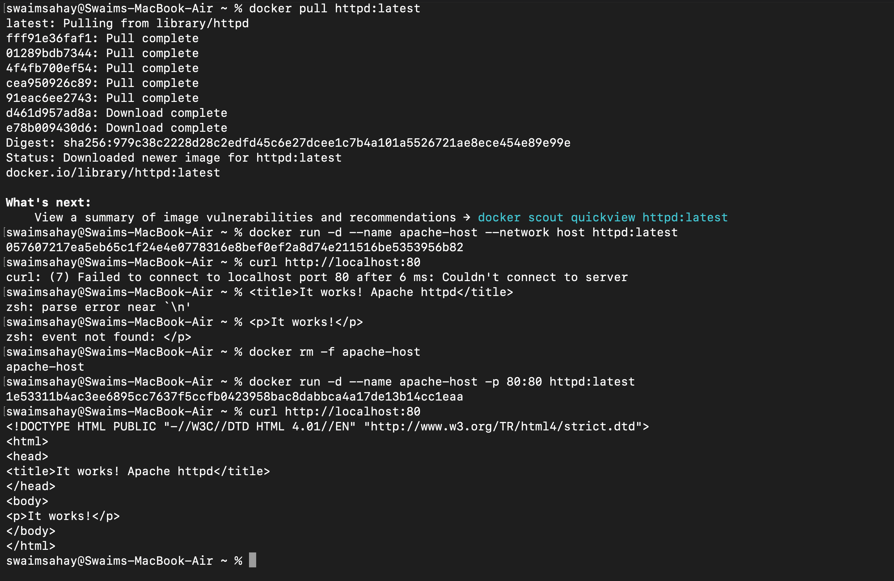
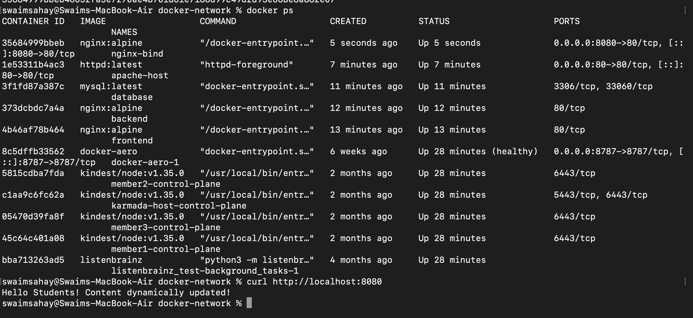

# Docker Networking and Volumes Assignment

This repository contains the practical and theoretical tasks demonstrating Docker network isolation, host networking, volume bind mounts, and overlay networks.

---

## Task 1: Docker Container Networking

**Objective:** Demonstrate network isolation and multi-network container attachments.

- Created three isolated bridge networks: `frontend-net`, `backend-net`, and `db-net`.
- Deployed a `frontend` (Nginx), `backend` (Nginx), and `database` (MySQL) container.
- Proved network isolation by showing the backend could not reach the frontend.
- Attached the `backend` container to `db-net` and successfully pinged the `database` container.

### Proof of Execution

---

## Task 2: Host Network

**Objective:** Bypass Docker's bridge network and bind a container directly to the host's network stack.

- Pulled the `httpd:latest` (Apache) image.
- Deployed the container using `--network host`.
- Accessed the default Apache landing page directly via `localhost:80` without publishing any ports via `-p`.

### Proof of Execution

---

## Task 3: Bind Mount

**Objective:** Mount a local host directory into a container to enable real-time file updates without container restarts.

- Created a local directory and generated an `index.html` file containing "Hello students".
- Mapped the local directory to `/usr/share/nginx/html` inside an Nginx container using a bind mount (`-v`).
- Proved the mount worked by accessing `localhost:8080`.
- Modified the local `index.html` file and verified the changes immediately reflected on the web server without restarting the container.

### Proof of Execution

---

## Task 4: Overlay Networks (Theoretical Research)

### What is a Docker Overlay Network?

An overlay network is a distributed network built on top of an existing underlying network (usually a host-level physical or virtual network). In Docker, the `overlay` network driver allows containers running on entirely different physical Docker hosts to communicate with each other seamlessly, as if they were on the same local bridge network.

### Use Cases

- **Docker Swarm & Kubernetes:** They form the backbone of container orchestration. When deploying a service across a cluster of multiple nodes, an overlay network ensures all replicas can securely route traffic to one another.

- **High Availability & Scaling:** If a container on Node A crashes and is rescheduled on Node B, it maintains its network identity on the overlay network, preventing service disruption.

- **Microservices Across Datacenters:** Securely routing traffic between microservices hosted on different VMs without exposing internal container ports to the public internet.

### How Overlay Networks Work Across Multiple Hosts

1. **VXLAN Encapsulation:** Docker uses Virtual eXtensible Local Area Network (VXLAN) technology. When a container on Host A sends a packet to a container on Host B, the Docker daemon on Host A intercepts the packet.

2. **Packet Wrapping:** Host A wraps the original Layer 2 packet inside a standard UDP packet.

3. **Transport:** This UDP packet is sent across the physical underlying network (the "underlay") to Host B.

4. **Unwrapping:** Host B receives the UDP packet, strips away the encapsulation, and delivers the original packet to the destination container.

5. **Control Plane:** The orchestration tool (like Docker Swarm) maintains a distributed key-value store (using the Raft consensus algorithm) that keeps track of which container IP addresses live on which physical hosts, allowing the VXLAN encapsulation to know exactly where to route the UDP packets.

---