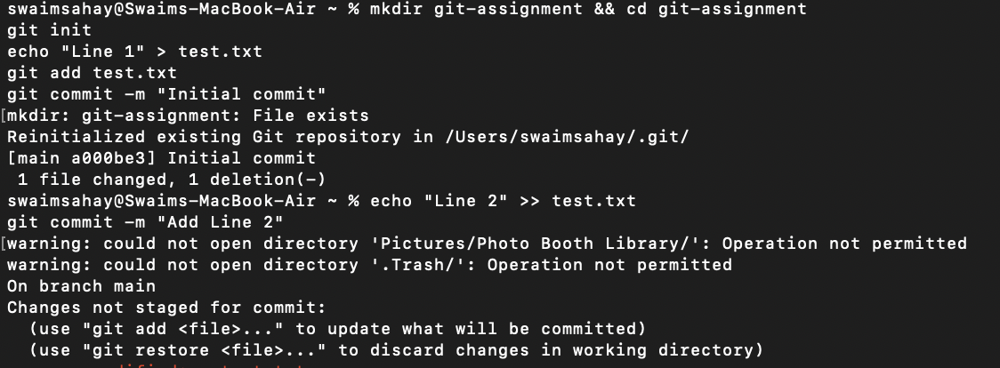
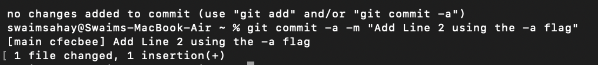
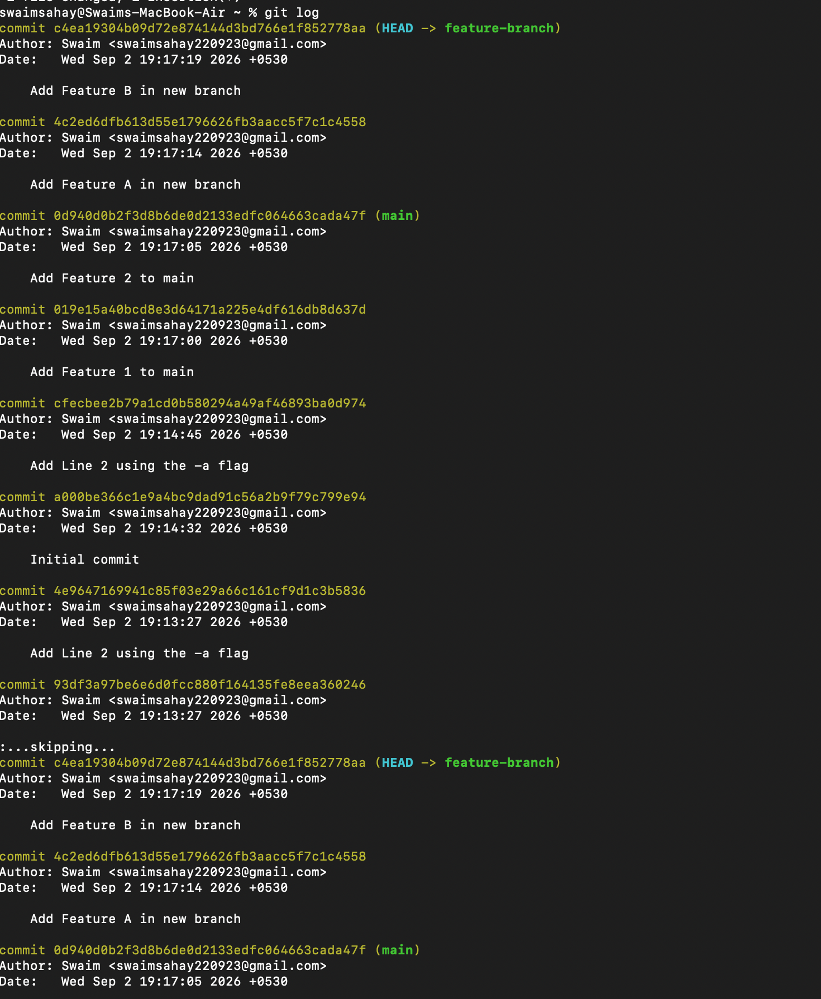
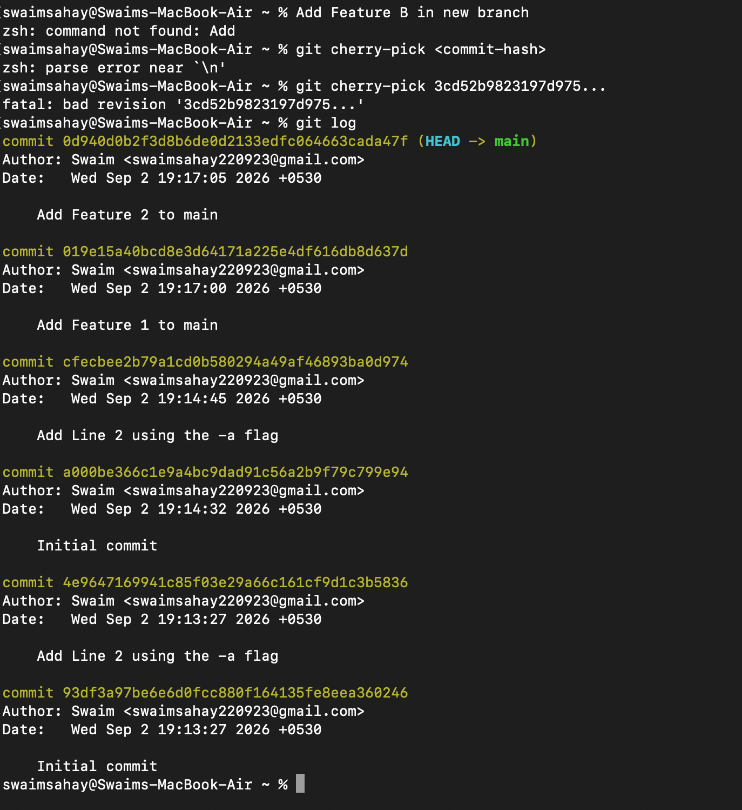

# Git Workflow Assignment: Commit Flags & Cherry-Picking

## Task 1: Understanding Commit Flags

### Theoretical Difference

- **`git commit -m "message"`**: Commits only the changes that have been explicitly staged using `git add`. If a tracked file is modified but not staged, this command will ignore it.

- **`git commit -a -m "message"`**: Automatically stages any modified or deleted files that Git is already tracking, and commits them in one step. It does **not** stage newly created (untracked) files.

### Practical Execution & Proof

1. Created a tracked file (`test.txt`) and modified it.
2. Attempted `git commit -m` without staging. As expected, Git threw a "Changes not staged for commit" error.
3. Ran `git commit -a -m`. Git successfully staged and committed the tracked modifications automatically.

### Proof of Execution

---

## Task 2: Git Cherry-Pick

### Workflow Performed

1. Generated baseline commits on the `main` branch.
2. Created and switched to `feature-branch`.
3. Made 2 additional isolated commits on `feature-branch`.
4. Used `git log --oneline` to identify the specific hash of the first commit on the new branch.
5. Switched back to `main` and executed `git cherry-pick <commit-hash>`.
6. Verified the selected commit was successfully duplicated onto `main`.

### Proof of Execution

**1. Identifying the target commit on `feature-branch`:**

**2. Successful cherry-pick execution and verification on `main`:**

