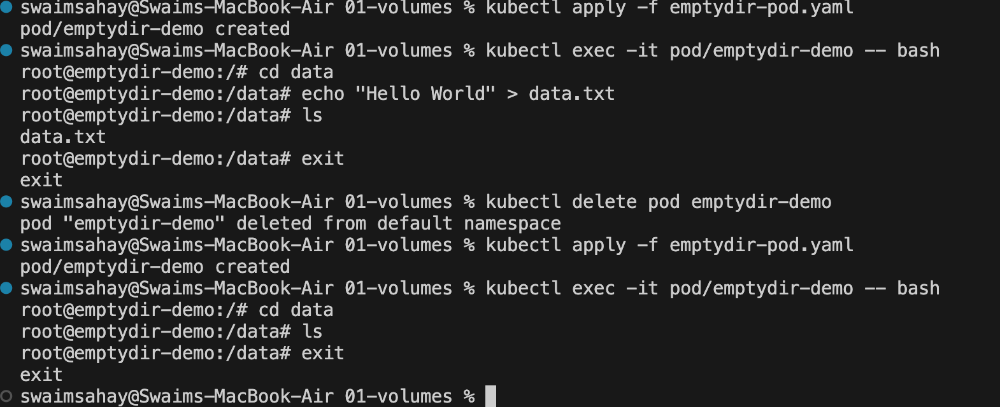
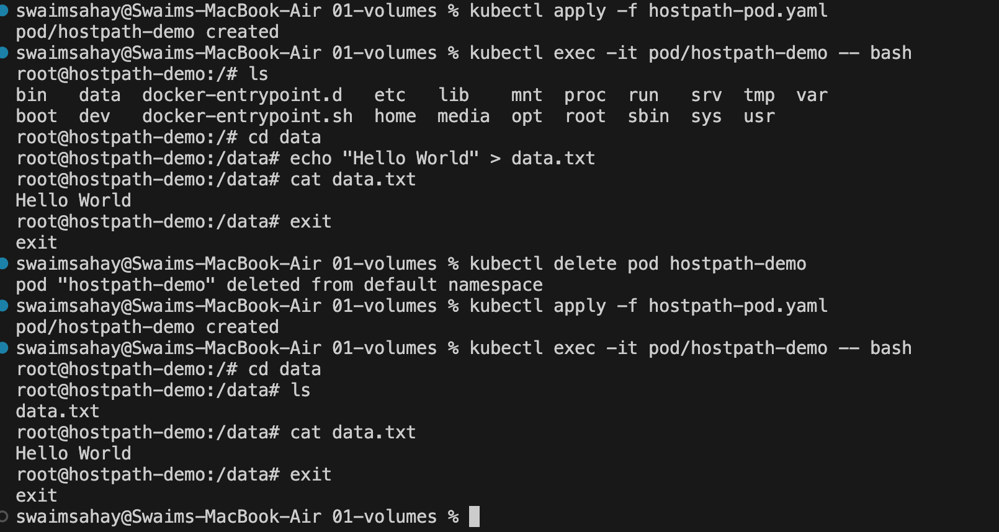
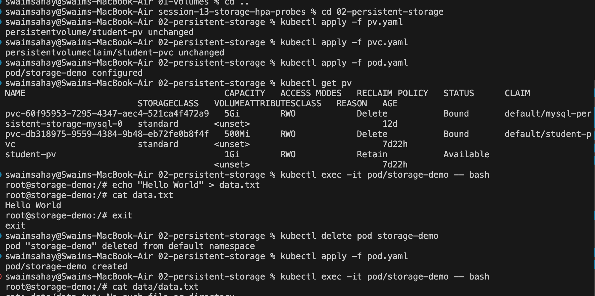
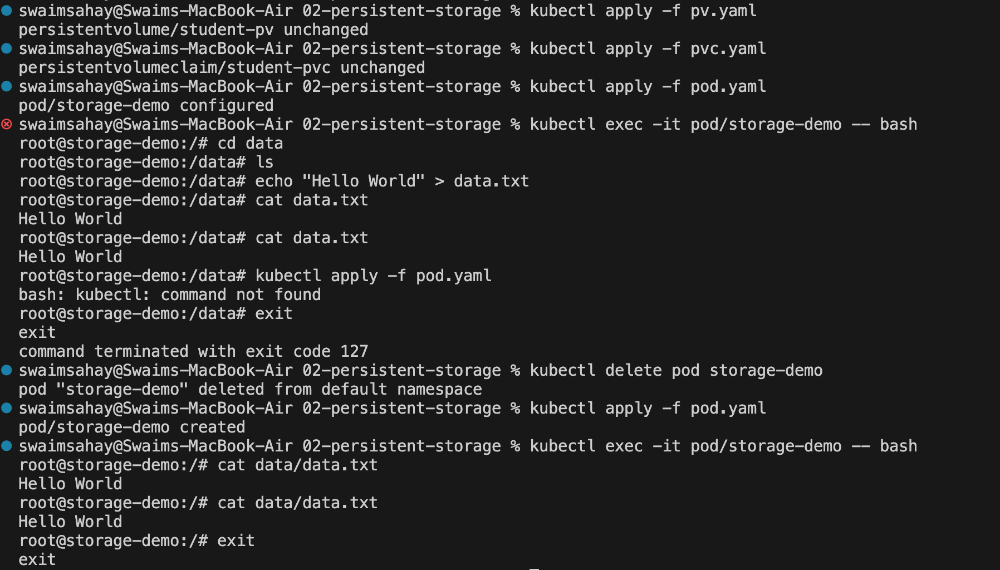
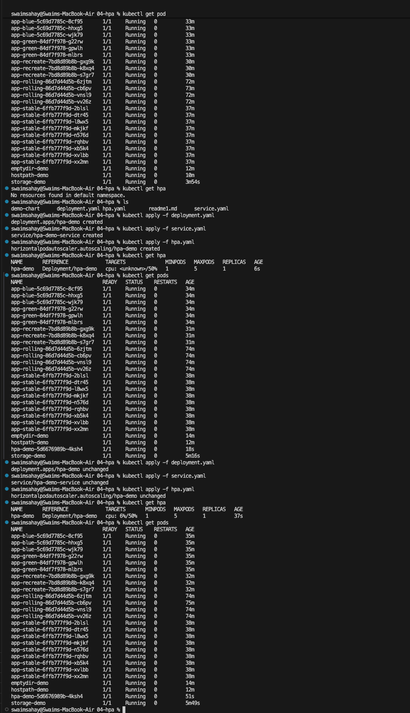
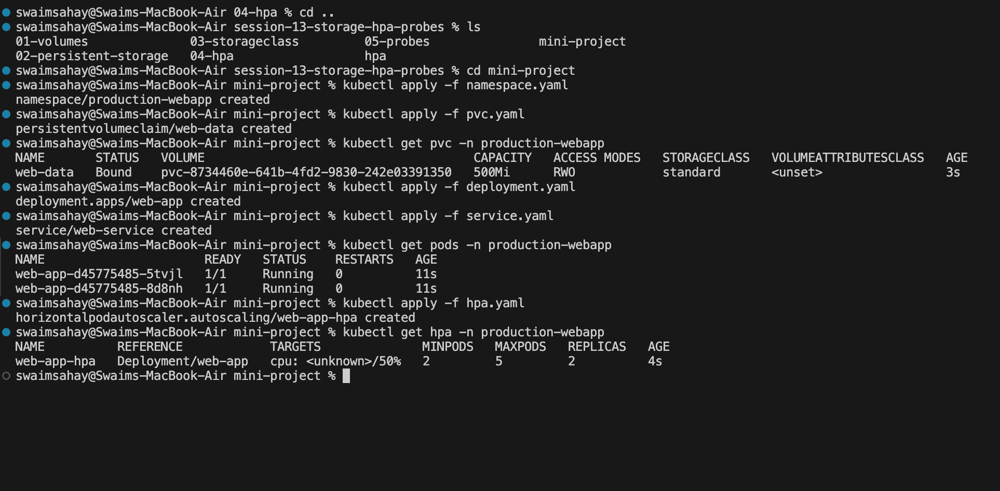
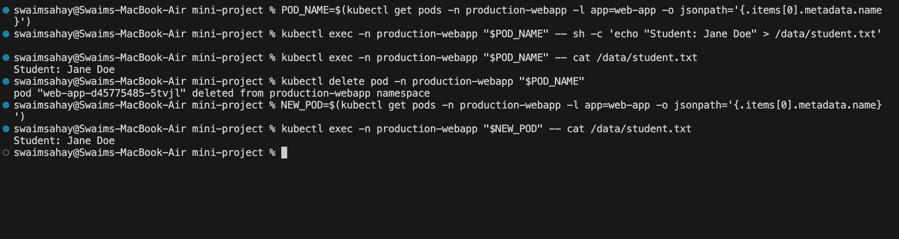
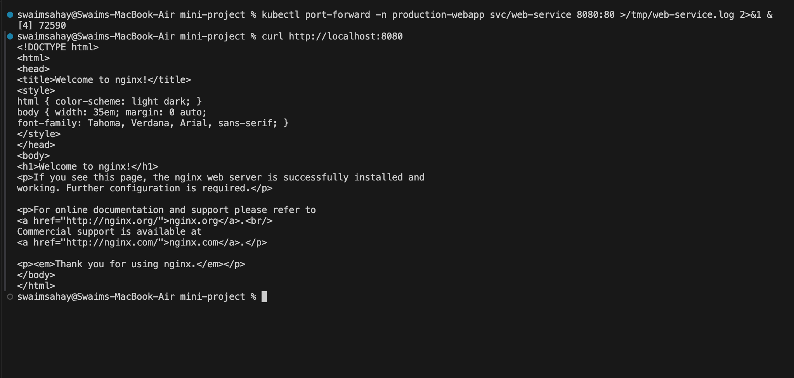

# Kubernetes Storage

## Volume
### Volume emptydir

### Volume hostpath

## Persistent Volume
### Persistent Volume on given path

### Persistent Volume on custom path

## HPA

## Mini Project
### Deployment

### Storage Verification

### Service Verification
