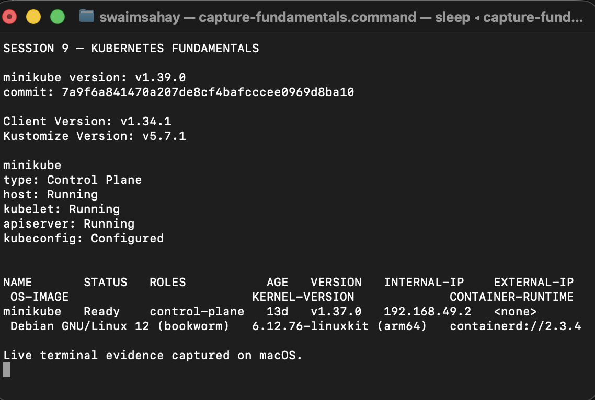
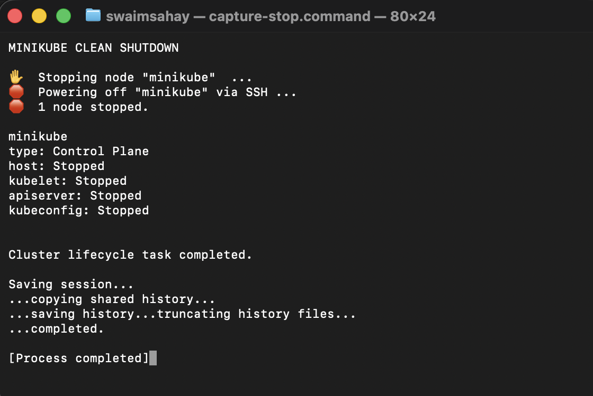

# Kubernetes Fundamental

## 1. Minikube and kubectl setup

**Description:** Verify that Minikube and kubectl are installed, then start a local single-node Kubernetes cluster.

```bash
minikube version
kubectl version --client=true
minikube start --driver=docker
minikube status
kubectl get nodes -o wide
```

**Observed result:** Minikube `v1.39.0` and kubectl client `v1.34.1` are installed. The Docker-driver Minikube cluster started with Kubernetes `v1.37.0`. The control plane components were Running and the `minikube` node was Ready.



## 2. Cluster lifecycle

```bash
# Start
minikube start --driver=docker

# Verify host, kubelet, API server, and kubeconfig
minikube status
kubectl cluster-info
kubectl get nodes -o wide

# Stop cleanly when the lab is complete
minikube stop
```

`minikube start` creates or resumes the local control-plane node. `minikube status` checks the host, kubelet, API server, and kubeconfig. `minikube stop` powers off the node while retaining the cluster profile for later reuse.



## 3. Kubernetes architecture

```text
kubectl / controller / scheduler
              |
              v
       +-----------------+
       | kube-apiserver  | <----> etcd
       +-----------------+
              |
              v
  +------------------------------+
  | Worker node                  |
  | kubelet -> container runtime |
  | kube-proxy -> Service rules  |
  | Pods -> application workload |
  +------------------------------+
```

| Area | Component | Responsibility |
| --- | --- | --- |
| Control plane | `kube-apiserver` | Authenticated REST API entry point. All components use the API server to read or change cluster objects. |
| Control plane | `etcd` | Consistent key-value database holding Kubernetes object state and desired configuration. |
| Control plane | `kube-scheduler` | Selects a suitable node for each unscheduled Pod after considering resources and constraints. |
| Control plane | `kube-controller-manager` | Runs reconciliation loops, for example keeping requested replicas running. |
| Worker node | `kubelet` | Node agent that receives Pod specifications and asks the container runtime to run containers. |
| Worker node | `kube-proxy` | Maintains networking rules that route Service traffic to ready Pod endpoints. |
| Worker node | Container runtime | Pulls images and runs containers using the CRI. |
| Workload | Pod | Smallest Kubernetes deployable unit; its containers share networking and volumes. |

### Component interaction

1. `kubectl apply` sends a desired object to `kube-apiserver`.
2. The API server validates the object and persists its state in `etcd`.
3. The scheduler assigns a pending Pod to a worker node.
4. The node's kubelet creates the Pod through the container runtime.
5. Controllers continuously compare actual and desired state, creating replacements when necessary.


