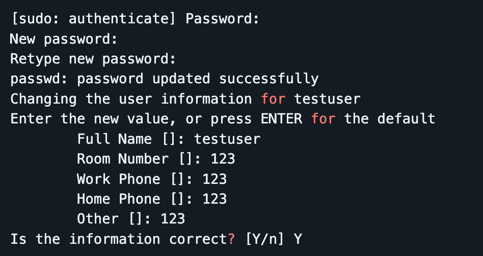
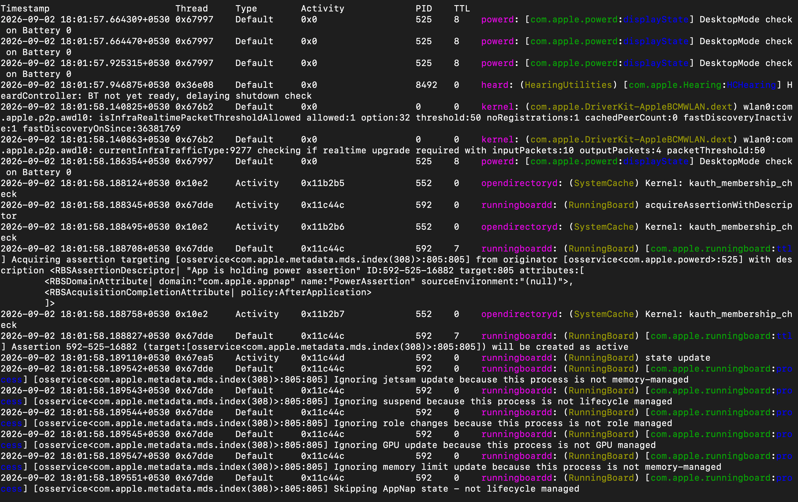
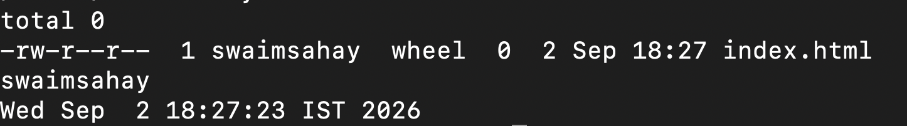

1. Soft Links vs. Hard Links

Hard Link: Creates a direct pointer to the underlying inode on the disk. Both the original file and the hard link share the exact same inode number and file data. Deleting the original file does not remove the data as long as at least one hard link remains.

Limitations: Cannot span across different file systems/partitions and cannot link directories (to prevent recursive loops).

Soft Link (Symlink): Creates a separate shortcut file that points to the path of the original file (stores the target filename as text). It has a unique inode. If the original file is deleted or moved, the soft link becomes a "broken link."

Advantages: Can span across file systems and can link directories.

Commands:

Hard Link: ln <target> <link_name>

Soft Link: ln -s <target> <link_name>

Commands & Expected Outputs

# Create a test file
echo "Hello Linux" > original.txt

# Create a Hard Link
ln original.txt hard_link.txt

# Create a Soft Link
ln -s original.txt soft_link.txt

# Verify inodes and link counts
ls -li original.txt hard_link.txt soft_link.txt

Expected Output

2. adduser vs. useradd

useradd: A low-level, native system utility used to add users. It does not automatically create a home directory, set up a user group, or prompt for a password unless specific flags are passed (e.g., useradd -m -s /bin/bash username).

adduser: A high-level, user-friendly Perl script wrapper around useradd (commonly found on Debian and Ubuntu systems). It interactively prompts for a password, automatically creates a home directory with default configuration files from /etc/skel, and sets up a dedicated user group.

Recommendation: adduser is the preferred choice on Ubuntu/Debian for administrators due to its automation and ease of use.

Commands & Expected Outputs

# Create a test user using the recommended adduser command
sudo adduser testuser

Expected Output

3. journalctl

journalctl is the query and display tool for systemd-journald, the service responsible for collecting and storing logging data in binary format on modern Linux distributions. It aggregates kernel logs, system daemon outputs, and standard error/output from services managed by systemd.

Key Usage:

View all logs: journalctl

View logs for a specific service (e.g., SSH): journalctl -u ssh

Follow logs in real-time: journalctl -f

View logs since boot: journalctl -b

Commands & Expected Output

# View recent system logs
journalctl -n 20

# View real-time logs for the ssh service
sudo journalctl -u ssh -f

Expected Output:

4. Linux Command Cheat Sheet

CommandDescription

ls

List directory contents.

cd

Change directory.

pwd

Print working directory.

mkdir

Make new directory.

rm

Remove files/directories.

touch

Create a new file.

cp

Copy files.

mv

Move or rename files.

cat

View file content.

less / more

View large files.

tail

View end of file.

head

View top of file.

grep

Search inside files.

ps

Show processes.

top / htop

System resource usage.

kill

Kill process by PID.

systemctl status

Check service status.

systemctl restart

Restart a service.

ping

Check connectivity.

ip a / ifconfig

Show IP/network config.

netstat

Show network connections.

curl

Fetch URL data.

wget

Download file.

chmod

Change file permissions.

chown

Change file owner.

apt

Install packages (Ubuntu/Debian).

yum

Install packages (RHEL/CentOS).

df

Show disk usage.

du

Show file/folder size.

crontab -e

Edit cron jobs.

nohup

Run command in background.

adduser

Add a new user.

useradd

Create user (non-interactive).

usermod

Modify user account.

passwd

Change user password.

id

Display UID, GID, and groups.

groups

Show groups user belongs to.

deluser / userdel

Delete a user.

who

List logged-in users.

w

Show who is logged in and what they are doing.

last

Show login history.

uname -a

Kernel & system info.

hostname

Show system hostname.

uptime

Show system uptime.

whoami

Current logged-in username.

history

Show command history.

date

Current system date/time.

clear

Clear terminal screen.

!! / !n

Run last command again / Run nth command from history.

Ctrl+C

Cancel running command.

Ctrl+L

Clear terminal screen.

Commands & Expected Output

# File, Directory, and Info Operations
pwd
mkdir -p /tmp/devops_practice
touch /tmp/devops_practice/index.html
ls -l /tmp/devops_practice
whoami
date

Expected Output:

