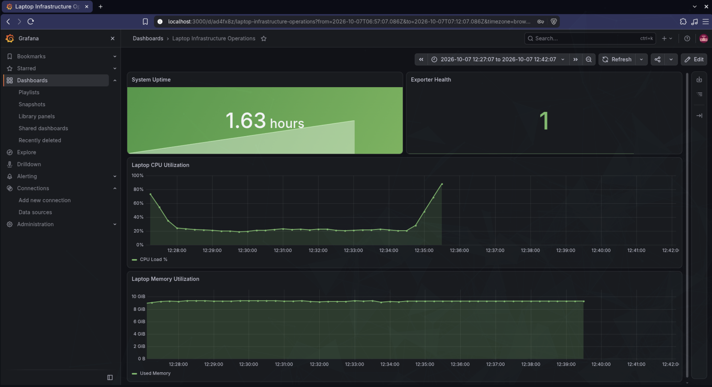

# Infrastructure Operations: Monitoring, Observability, & GitOps

This repository contains the documentation, configurations, and demonstration artifacts for implementing a modern infrastructure operations stack, focusing on Monitoring, Observability, and GitOps workflows.

## Task 1: Monitoring Fundamentals

Monitoring is the continuous process of collecting, analyzing, and using information to track a program's progress toward reaching its objectives and to guide management decisions.

*   **Metrics:** Quantitative data points measured over time (e.g., request rate, error rate).
*   **Logs:** Immutable, timestamped records of discrete events that happened over time within a system.
*   **Alerts:** Actionable notifications triggered when metrics or logs breach predefined thresholds, indicating a potential issue.
*   **CPU & Memory Utilization:** Core hardware metrics. CPU tracks processing load, while memory tracks RAM consumption. High utilization in either often precedes application degradation.
*   **Application Health:** High-level status indicators (often exposed via `/health` or `/ready` endpoints) that signal if the application is running and capable of handling traffic.

---

## Task 2: Observability Deep Dive

Observability is a measure of how well internal states of a system can be inferred from knowledge of its external outputs. While monitoring tells you *when* a system is failing, observability tells you *why*.

### The Three Pillars
1.  **Metrics:** Provide a bird's-eye view of system health and performance trends.
2.  **Logs:** Provide high-fidelity context for specific events and errors.
3.  **Traces:** Track the progression of a single user request as it traverses across distributed microservices.

### Why Observability is Required
In distributed systems (like microservices), a single failure can cascade. Observability allows teams to debug complex, unpredictable behaviors in production environments quickly, reducing Mean Time to Resolution (MTTR).

### Common Tools & Kubernetes Observability
*   **Metrics:** Prometheus, Grafana, Datadog.
*   **Logs:** ELK Stack (Elasticsearch, Logstash, Kibana), Fluentd, Grafana Loki.
*   **Traces:** Jaeger, Zipkin, OpenTelemetry.
*   **Kubernetes Context:** In Kubernetes, observability requires tracking ephemeral resources (Pods, Containers) dynamically. Tools like `kube-state-metrics` and `cAdvisor` are essential for scraping cluster-level and container-level metrics.

---

## Task 3: GitOps Workflow

GitOps is an operational framework that takes DevOps best practices used for application development (such as version control, collaboration, compliance, and CI/CD) and applies them to infrastructure automation.

*   **Git as the Source of Truth:** The entire system state is stored in a Git repository. If a cluster dies, it can be entirely recreated from Git.
*   **Declarative Configuration:** Infrastructure and applications are defined by what they should look like (e.g., YAML manifests), not the steps taken to create them.
*   **Continuous Reconciliation:** Software agents (like ArgoCD or Flux) run in the cluster, constantly comparing the live state against the Git state. If they diverge, the agent automatically corrects the live state.
*   **Kubernetes + GitOps:** GitOps is the natural evolution of Kubernetes management. Instead of running `kubectl apply` manually, developers push code to Git, and the GitOps controller pulls those changes into the cluster.

---

### Grafana Dashboard: System Overview

