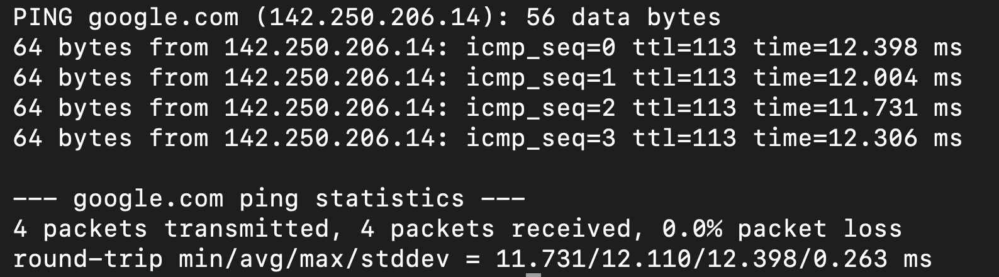
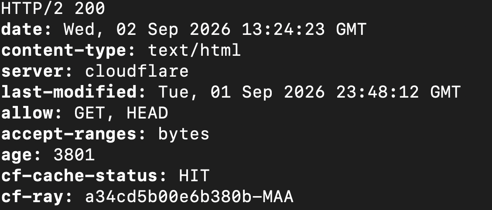
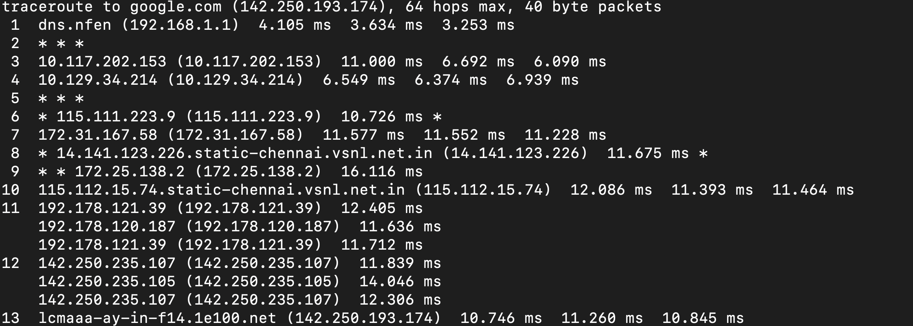
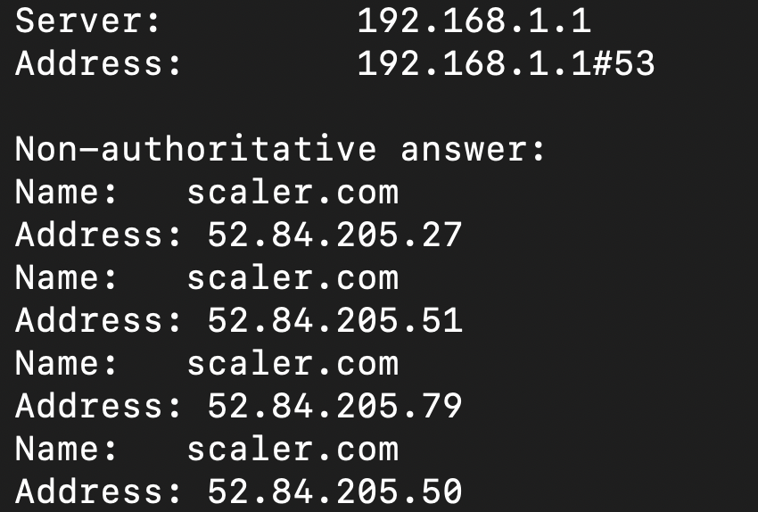
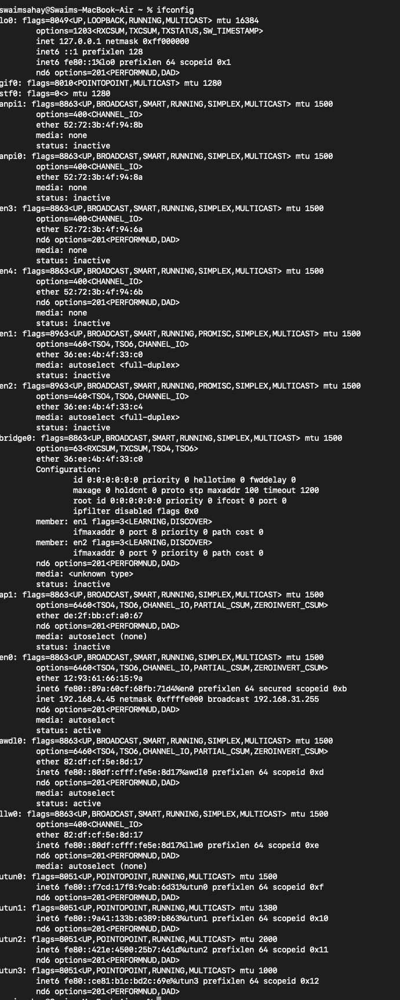
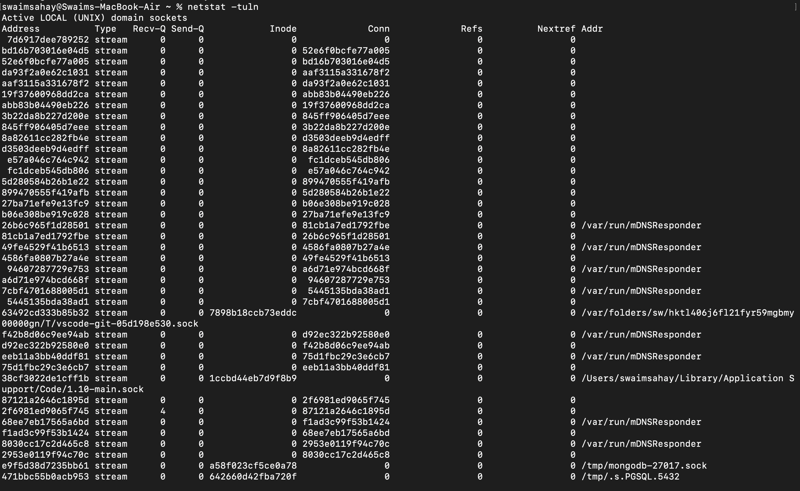
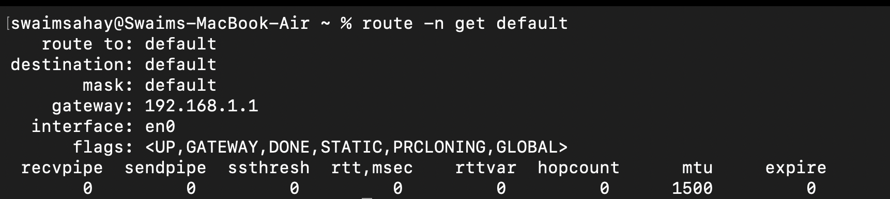

# Networking Commands Practice

This document contains the execution outputs and explanations for fundamental networking commands as part of the devops-hero practice tasks.

---

## 1. Ping Command

### Command Executed

```bash
ping -c 4 google.com
```

### Output



### Explanation

The ping command is a fundamental diagnostic tool used to test the reachability of a host on an IP network. It works by sending ICMP (Internet Control Message Protocol) Echo Request packets to the target and waiting for an ICMP Echo Reply. The output shows whether the packets successfully reached the destination, if any packets were lost (packet loss), and how long it took for the round trip (latency/time).

---

## 2. Curl Command

### Command Executed

```bash
curl -I https://example.com
```

### Output



### Explanation

curl (Client URL) is a command-line tool used for transferring data to or from a server using various protocols such as HTTP, HTTPS, and FTP. It is heavily used in DevOps to test REST APIs, download files, or check if a web server is responding correctly.

Using -I fetches only the HTTP headers for a cleaner output.

---

## 3. Traceroute Command

### Command Executed

```bash
traceroute google.com
```

### Output



### Explanation

While ping tells you if a server is reachable, traceroute tells you how your traffic gets there. It maps the path, or routing hops, that a packet takes from your local machine to the destination server.

It does this by gradually increasing the Time to Live (TTL) of packets. This is useful for finding out where a connection is failing or becoming slow across the network.

---

## 4. Nslookup Command

### Command Executed

```bash
nslookup scaler.com
```

### Output



### Explanation

nslookup (Name Server Lookup) is a tool used to query the Domain Name System (DNS). It translates human-readable domain names into the IP addresses that computers use to communicate.

The output shows the DNS server used to resolve the query and the resulting IP addresses for the requested domain.

---

## 5. Ifconfig Command

### Command Executed

```bash
ifconfig
```

### Output



### Explanation

ifconfig (Interface Configuration) displays the current network configuration of your system's network interfaces, such as Wi-Fi or Ethernet cards.

It shows details such as:

- Local IP address
- Subnet mask
- MAC address
- Packets transmitted
- Packets received
- Network errors

---

## 6. Netstat Command

### Command Executed

```bash
netstat -tuln
```

### Output



### Explanation

netstat (Network Statistics) provides information about active network connections, routing tables, and listening ports.

The flags are commonly used as:

- `-t` → TCP
- `-u` → UDP
- `-l` → Listening
- `-n` → Numerical format

This is useful for checking whether services are actively running and accepting connections.

---

## 7. Route Command

### Command Executed

```bash
route -n
```

### Output



### Explanation

The route command allows you to view and manipulate the IP routing table of the operating system.

The routing table determines where network traffic is directed based on its destination IP. The default route is used for traffic that is not destined for the local network.

---

## 8. Hostname Command

### Command Executed

```bash
hostname
```

### Output


### Explanation

The hostname command displays the network name of the current machine.

This name is used to identify the device on a local network and is often used in logs, command prompts, and internal DNS resolution.

---

## 9. Dig Command

### Command Executed

```bash
dig scaler.com +short
```

### Output


### Explanation

dig (Domain Information Groper) is a command-line tool used for querying DNS name servers.

It performs DNS lookups and displays the answers returned by the queried name servers. The +short option removes the verbose information and displays only the resolved IP addresses.